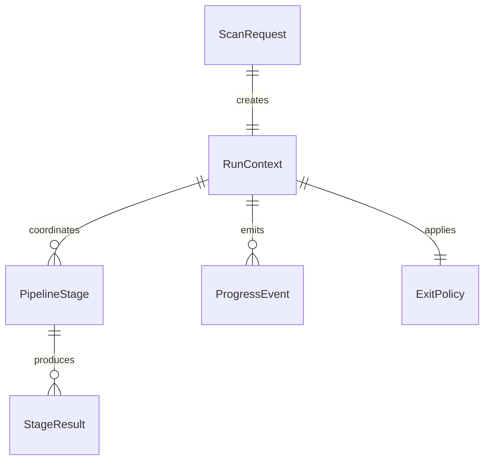

| Entity | Attributes (name: type, constraints) | Relationships | State Transitions |
|--------|--------------------------------------|---------------|-------------------|
| ScanRequest | archive_root: string REQUIRED, interactive: bool DEFAULT false, stdout: writer OPTIONAL, stderr: writer OPTIONAL | creates_one: RunContext | Created -> Validated -> Submitted |
| RunContext | request: ScanRequest REQUIRED, exit_policy: ExitPolicy REQUIRED, progress_sink: ProgressSink REQUIRED, logger: Logger OPTIONAL | belongs_to: ScanRequest, coordinates_many: PipelineStage, emits_many: ProgressEvent | Initialized -> Running -> Completed or Failed |
| PipelineStage | name: string REQUIRED, order: int REQUIRED, enabled: bool DEFAULT true | belongs_to: RunContext, produces_many: StageResult | Registered -> Ready -> Executing -> Finished or Failed |
| ProgressEvent | kind: enum(status|warning|metric) REQUIRED, message: string OPTIONAL, current_path: string OPTIONAL, files_seen: int DEFAULT 0, warnings: int DEFAULT 0 | emitted_by: RunContext, observed_by: ProgressSink | Emitted -> Delivered |
| StageResult | stage_name: string REQUIRED, status: enum(skipped|success|failure) REQUIRED, fatal: bool DEFAULT false, error_message: string OPTIONAL | belongs_to: PipelineStage | Pending -> Success or Failure |
| ExitPolicy | success_code: int REQUIRED, invalid_input_code: int REQUIRED, runtime_failure_code: int REQUIRED | applied_to: RunContext | Defined |

ER Diagram (visual reference)

