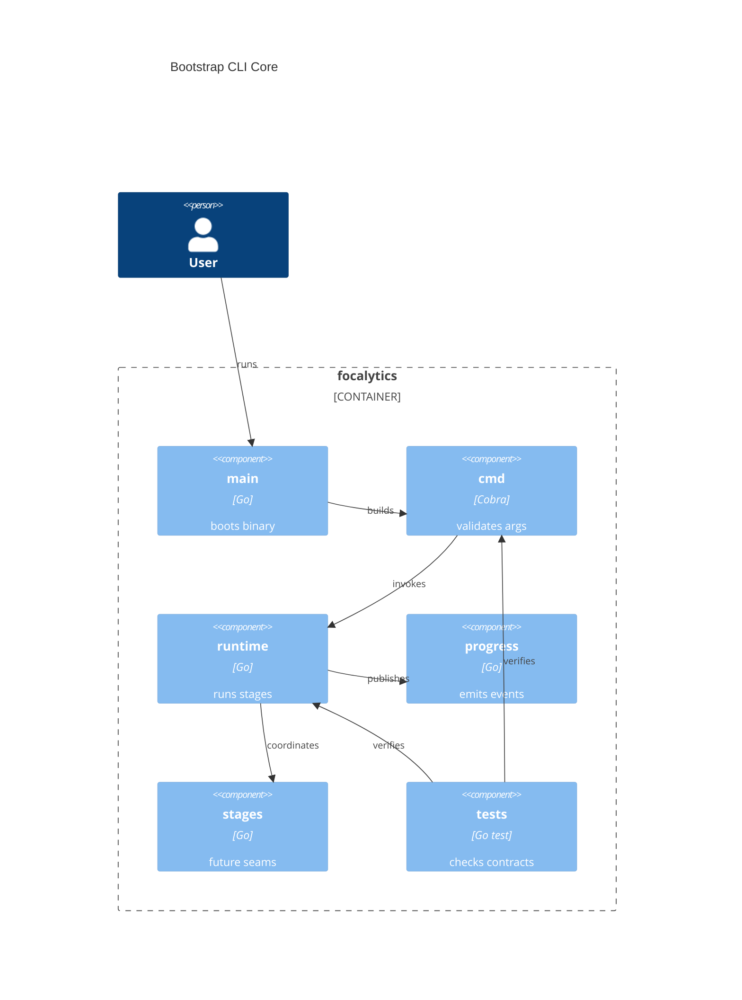

# Implementation Plan: Bootstrap CLI Core

**Branch**: `00001-bootstrap-cli-core` | **Date**: 2026-04-05 | **Spec**: `specs/00001-bootstrap-cli-core/spec.md`

## Summary

**Goal**: Establish the first buildable focalytics CLI scaffold with stable runtime contracts, deterministic exit codes, and a reusable test baseline.  
**Approach**: Build a thin Cobra entrypoint under /src, isolate runtime interfaces in internal packages, and validate the skeleton with native Go build, test, lint, and vulnerability tooling.  
**Key Constraint**: Preserve the /src-only source layout, offline runtime posture, and UI-agnostic progress boundary while later epics remain unimplemented.

## Technical Context

**Language/Version**: Go 1.24  
**Primary Dependencies**: Cobra, Bubble Tea, Bubbles, go-exif (future epic), Go stdlib  
**Storage**: N/A — transient in-memory runtime state only  
**Testing**: `go test`, table-driven package tests, integration-tagged tests, `go tool cover`  
**Target Platform**: Desktop CLI on macOS, Windows, and Linux  
**Project Type**: single  
**Project Mode**: greenfield  
**Performance Goals**: Command startup and validation must stay near-instant; foundational tests should complete in seconds; progress contracts must support later responsive scans without re-architecture  
**Constraints**: Source code under /src, offline-only runtime, no source-archive mutation, no persistent database, non-TTY-safe execution, cross-platform buildability  
**Scale/Scope**: One local binary, one scan invocation at a time, foundational package set for later archive-analysis waves

## Instructions Check

| Principle | Status | Plan Response |
|-----------|--------|---------------|
| Narrow Product Scope | PASS | Limits work to CLI bootstrap and shared runtime contracts only. |
| Local-First Safety | PASS | Keeps execution offline, stateless, and non-mutating. |
| Modular Pipeline Design | PASS | Separates command, runtime, discovery, metadata, aggregation, rendering, and progress packages under /src. |
| Honest Data Reporting | PASS | Reserves explicit warning and progress channels in the runtime contract. |
| Cross-Platform Release Quality | PASS | Uses stable binary naming, exit codes, and test commands suitable for later release automation. |

## Architecture



## Architecture Decisions

| ID | Decision | Options Considered | Chosen | Rationale |
|----|----------|--------------------|--------|-----------|
| AD-001 | How should CLI commands be constructed? | Package-global Cobra init wiring / constructor-based commands | Constructor-based commands | Keeps dependencies explicit and lets tests instantiate commands directly. |
| AD-002 | Where should orchestration live? | `main` package / Cobra handlers / internal runtime coordinator | Internal runtime coordinator | Preserves modular package boundaries inside the single binary. |
| AD-003 | How should progress integrate with Bubble Tea? | Bubble Tea owns orchestration / UI-agnostic event sink | UI-agnostic event sink | Allows CI and non-TTY execution without redesign. |
| AD-004 | What is the foundational QC stack? | Third-party test wrappers / Go-native tooling with focused additions | Go-native tooling with `golangci-lint` and `govulncheck` | Satisfies project policy with low-friction, ecosystem-standard tools. |

## Data Model Summary

| Entity | Key Fields | Relationships | Notes |
|--------|------------|---------------|-------|
| ScanRequest | archive_root, interactive, stdout, stderr | creates RunContext | Captures one CLI invocation. |
| RunContext | request, exit_policy, progress_sink, logger | coordinates PipelineStage, emits ProgressEvent | Shared per-run execution state. |
| PipelineStage | name, order, enabled | belongs to RunContext, produces StageResult | Future discovery and rendering seams. |
| ProgressEvent | kind, message, current_path, files_seen, warnings | observed through ProgressSink | Remains UI-agnostic. |
| StageResult | stage_name, status, fatal, error_message | belongs to PipelineStage | Encodes per-stage outcome. |
| ExitPolicy | success_code, invalid_input_code, runtime_failure_code | applied to RunContext | Stabilizes exit mapping early. |

**Detail**: `specs/00001-bootstrap-cli-core/data-model.md`

## API Surface Summary

| Method | Path | Purpose | Auth | Req/Res Types |
|--------|------|---------|------|---------------|
| CLI | `focalytics <archive-root>` | Start one archive-analysis run | local user | `ScanRequest -> exit code` |
| Go | `NewRootCommand` | Build the root CLI command | none | `Dependencies -> *cobra.Command` |
| Go | `NewRunCommand` | Build the primary run command | none | `Runner, ExitPolicy -> *cobra.Command` |
| Go | `Runner.Run` | Coordinate runtime stages | none | `context.Context, ScanRequest -> RunResult, error` |
| Go | `ProgressSink.Publish` | Consume runtime progress updates | none | `ProgressEvent -> error/none` |

**Detail**: `specs/00001-bootstrap-cli-core/contracts/`

## Testing Strategy

| Tier | Tool | Scope | Mock Boundary | Install |
|------|------|-------|---------------|---------|
| Unit | `go test -race -count=1 ./...` | Command constructors, validation, exit policy, runtime helpers | Mock future stages and progress sink | configured |
| Integration | `go test -tags=integration -count=1 ./...` | CLI invocation against temp directories and injected IO streams | Mock downstream stage implementations; use temp filesystem only | configured |
| Security | `govulncheck ./...` | Reachable dependency and code vulnerability scan for Go packages | — | `brew install govulncheck` or `go install golang.org/x/vuln/cmd/govulncheck@latest` |
| Coverage | `go test -coverprofile=coverage.out -coverpkg=./... ./...` | Cross-package coverage measurement with 80% target | — | configured |

## Error Handling Strategy

N/A — CLI bootstrap uses a small, deterministic exit-code contract and stderr diagnostics instead of a richer response matrix.

## Integration Points

| Spec Reference | System/Service | Technical Approach | Contract |
|----------------|----------------|--------------------|----------|
| IP-001 | E002 discovery runtime | Expose `ScanRequest`, `RunContext`, and `ProgressSink` from shared internal packages | `contracts/runtime-contracts.md` |
| IP-002 | E003/E004 stage implementations | Define `Stage`/`Runner` seams that later epics can implement without altering Cobra wiring | `contracts/runtime-contracts.md` |
| IP-003 | E005 renderer integration | Reserve a rendering stage slot and stable fatal error mapping | `contracts/runtime-contracts.md` |
| IP-004 | E006 release automation | Stabilize binary entrypoint and baseline test commands for CI reuse | `plan.md` Testing Strategy |

## Risk Mitigation

| Risk (from spec) | Likelihood | Impact | Mitigation | Owner |
|-------------------|------------|--------|------------|-------|
| Boundary overdesign | Medium | Medium | Keep only the interfaces needed for command execution, progress publication, and stage coordination; defer richer abstractions until later epics prove them necessary. | runtime package |
| Runtime drift | Medium | High | Pin exit behavior and command constructors in tests before later epics extend the pipeline. | cmd package |
| TTY coupling | Low | Medium | Define a no-op progress sink and keep event payloads free of Bubble Tea types. | progress package |

## Requirement Coverage Map

| Req ID | Component(s) | File Path(s) | Notes |
|--------|--------------|--------------|-------|
| TR-001 | binary entrypoint, root command | `src/main.go`, `src/cmd/root.go` | Builds the executable and delegates work out of Cobra handlers. |
| TR-002 | command constructors | `src/cmd/root.go`, `src/cmd/run.go` | Avoids package-global command registration. |
| TR-003 | runtime models, runner, stage interfaces | `src/internal/app/request.go`, `src/internal/app/context.go`, `src/internal/pipeline/stage.go` | Shared contracts for later epics. |
| TR-004 | exit policy, error mapping | `src/internal/app/exitcodes.go`, `src/cmd/run.go` | Centralizes success, invalid-input, and fatal-runtime codes. |
| TR-005 | progress contracts, no-op sink | `src/internal/progress/event.go`, `src/internal/progress/sink.go` | Keeps UI optional and non-interactive-safe. |
| TR-006 | foundational tests | `src/cmd/root_test.go`, `src/cmd/run_test.go`, `src/internal/app/exitcodes_test.go` | Establishes the baseline `go test` contract. |

## Project Structure

### Source Code

```text
.golangci.yml
go.work
src/
  go.mod
  go.sum
  main.go
  main_test.go
  cmd/
    root.go
    run.go
    run_integration_test.go
    root_test.go
    run_test.go
  internal/
    app/
      request.go
      context.go
      exitcodes.go
      context_test.go
      exitcodes_test.go
    pipeline/
      runner.go
      stage.go
      runner_test.go
    progress/
      event.go
      sink.go
      noop.go
      noop_test.go
```

## Implementation Hints

- **[HINT-001]** Order: Add the Go module and entrypoint before command packages so imports settle once.
- **[HINT-002]** Gotcha: Keep Cobra command constructors pure; execution side effects belong in `RunE` closures or runtime types.
- **[HINT-003]** Constraint: Do not stub later epics with fake discovery or rendering behavior; use no-op stage wiring instead.
- **[HINT-004]** Compatibility: Keep path validation and exit code behavior platform-neutral across macOS, Windows, and Linux.
- **[HINT-005]** Performance: Progress events should be small value objects so later high-volume scans do not force interface redesign.