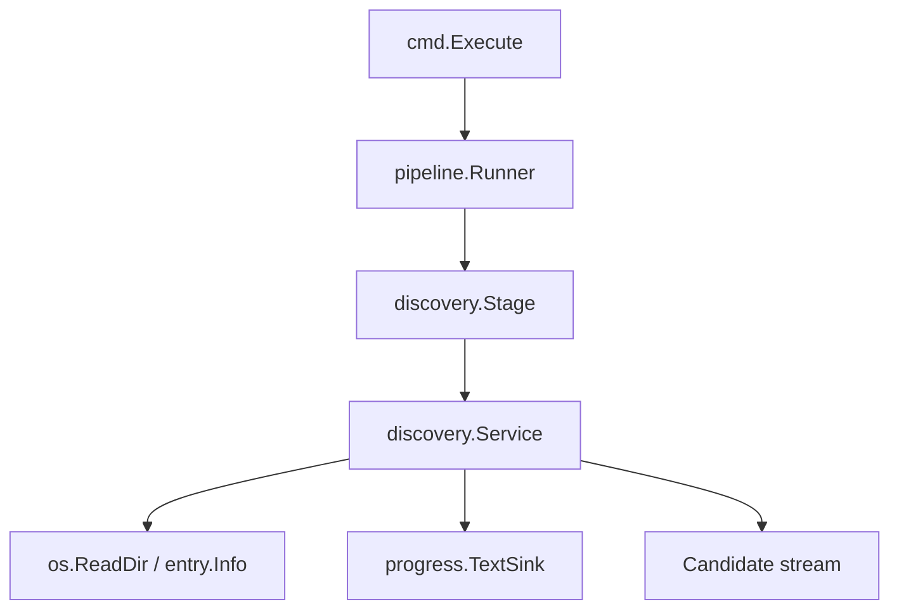

# Implementation Plan: Discover Archive Files

**Branch**: `00002-discover-archive-files` | **Date**: 2026-04-05 | **Spec**: `specs/00002-discover-archive-files/spec.md`

## Summary

**Goal**: Traverse real local archives deterministically, emit supported discovery candidates, and surface live progress plus warnings through the existing CLI runtime.  
**Approach**: Add an internal discovery service and stage under `/src`, extend the progress event model with traversal metrics, and wire a text-based progress sink into the command execution path.  
**Key Constraint**: Preserve the E001 command and exit-code contracts while continuing past unreadable child entries and avoiding symlink traversal surprises.

## Technical Context

**Language/Version**: Go 1.24  
**Primary Dependencies**: Go stdlib, Cobra, existing E001 runtime packages  
**Storage**: none  
**Testing**: `go test -race -count=1 ./...`, `go test -tags=integration -count=1 ./...`, `golangci-lint run ./...`, `govulncheck ./...`, `go test -count=1 -coverprofile=coverage.out -coverpkg=./... ./...`  
**Target Platform**: Desktop CLI on macOS, Windows, and Linux  
**Project Type**: single  
**Project Mode**: greenfield extension  
**Performance Goals**: Traversal should remain responsive for large archives, progress updates should be cheap value writes, and deterministic ordering must not require a second pass beyond directory reads  
**Constraints**: Source code under `/src`, offline-only runtime, no source-archive mutation, deterministic traversal order, non-interactive-safe progress output  
**Scale/Scope**: One archive scan at a time, nested local filesystems, candidate emission for supported images and sidecars only

## Instructions Check

| Principle | Status | Plan Response |
|-----------|--------|---------------|
| Narrow Product Scope | PASS | Limits work to archive discovery and progress visibility only. |
| Local-First Safety | PASS | Traversal is read-only, offline, and explicit about skipped entries. |
| Modular Pipeline Design | PASS | Discovery logic lands in its own package and stage rather than inside Cobra handlers. |
| Honest Data Reporting | PASS | Warnings and progress metrics are surfaced directly through the runtime sink. |
| Cross-Platform Release Quality | PASS | Uses only stdlib filesystem APIs and path normalization that remain portable. |

## Architecture



## Architecture Decisions

| ID | Decision | Options Considered | Chosen | Rationale |
|----|----------|--------------------|--------|-----------|
| AD-001 | How should traversal order be enforced? | `filepath.WalkDir` defaults / manual sorted recursion | Manual recursion using `os.ReadDir` | Keeps ordering explicit and lets child-read errors be handled per directory. |
| AD-002 | How should progress be surfaced? | Bubble Tea integration now / text sink over existing progress events | Text sink over progress events | Satisfies responsiveness without forcing a TTY dependency before later UI work. |
| AD-003 | How should unreadable children be modeled? | Fail immediately / silent skip / warning and continue | Warning and continue | Matches the epic acceptance criteria and honest reporting principle. |
| AD-004 | How should candidates be emitted? | Internal-only slice / stdout lines plus typed result | Typed result plus stdout candidate lines | Preserves a reusable internal model while giving the first increment visible behavior. |

## Data Model Summary

| Entity | Key Fields | Relationships | Notes |
|--------|------------|---------------|-------|
| Candidate | kind, path, relative_path | belongs to DiscoveryResult | Represents one supported image or sidecar file. |
| DiscoveryWarning | path, message | belongs to DiscoveryResult | Captures non-fatal traversal problems. |
| DiscoveryResult | candidates, warnings, files_seen, directories_seen | produced by discovery.Service | Shared summary for stage completion and future epics. |
| Progress Event | current_path, files_seen, candidates_found, warnings, throughput_per_second | published by discovery.Service | Extended existing event model for scan responsiveness. |

## API Surface Summary

| Method | Path | Purpose | Auth | Req/Res Types |
|--------|------|---------|------|---------------|
| Go | `discovery.NewService` | Build the archive discovery service | none | `Service` |
| Go | `Service.Discover` | Traverse a root, emit candidates, and publish progress | none | `root, sink, stdout -> DiscoveryResult, error` |
| Go | `discovery.NewStage` | Adapt discovery into the pipeline stage contract | none | `Service -> pipeline.Stage` |
| Go | `progress.TextSink.Publish` | Render progress events to stderr | none | `Event -> error/none` |

## Testing Strategy

| Tier | Tool | Scope | Mock Boundary | Install |
|------|------|-------|---------------|---------|
| Unit | `go test -race -count=1 ./...` | Discovery filtering, deterministic ordering, warning handling, progress rendering | Inject filesystem readers for child error cases | configured |
| Integration | `go test -tags=integration -count=1 ./...` | Full CLI traversal against temp archive trees | Temp filesystem only | configured |
| Static Analysis | `golangci-lint run ./...` | Discovery, progress, and command wiring packages | none | configured |
| Security | `govulncheck ./...` | Reachable vulnerability scan for the Go module | none | configured |
| Coverage | `go test -count=1 -coverprofile=coverage.out -coverpkg=./... ./...` | Cross-package coverage including new discovery logic | none | configured |

## Error Handling Strategy

- Root validation remains in the command layer and returns invalid-input errors before discovery begins.
- Child directory read or entry stat failures become discovery warnings and progress warning events instead of fatal errors.
- Discovery stage errors are reserved for unrecoverable stage-level failures, not routine child-entry problems.

## Integration Points

| Spec Reference | System/Service | Technical Approach | Contract |
|----------------|----------------|--------------------|----------|
| US1 | E001 command runner | Wire a discovery stage into `pipeline.NewRunner` inside `cmd.Execute` | `src/cmd/root.go`, `src/internal/pipeline/runner.go` |
| US2 | Progress reporting | Extend `progress.Event` and add `progress.TextSink` for stderr rendering | `src/internal/progress/` |
| US3 | E003 dependency handoff | Retain a typed candidate model inside the discovery package for later metadata use | `src/internal/discovery/` |

## Risk Mitigation

| Risk (from spec) | Likelihood | Impact | Mitigation | Owner |
|-------------------|------------|--------|------------|-------|
| Traversal drift | Medium | High | Sort child entries and cover order with unit and integration tests. | discovery package |
| Progress spam | Medium | Medium | Keep text progress to compact single-line updates with stable counters. | progress package |
| Filesystem surprises | Medium | Medium | Skip symlinks explicitly and convert child errors into warnings. | discovery package |

## Requirement Coverage Map

| Req ID | Component(s) | File Path(s) | Notes |
|--------|--------------|--------------|-------|
| FR-001 | discovery service, stage | `src/internal/discovery/service.go`, `src/internal/discovery/stage.go` | Recursive deterministic traversal. |
| FR-002 | candidate model, filtering | `src/internal/discovery/candidate.go`, `src/internal/discovery/service.go` | Supported image and sidecar detection. |
| FR-003 | traversal guards | `src/internal/discovery/service.go` | Unsupported files ignored and symlinks skipped. |
| FR-004 | progress event model, text sink | `src/internal/progress/event.go`, `src/internal/progress/text.go`, `src/cmd/root.go` | Live progress on stderr. |
| FR-005 | existing command validation | `src/cmd/run.go` | Invalid root fast-fail behavior preserved. |
| FR-006 | warning model, tests | `src/internal/discovery/service.go`, `src/internal/discovery/service_test.go` | Child-read warnings continue traversal. |

## Project Structure

### Source Code

```text
src/
  cmd/
    root.go
    run_integration_test.go
    run_test.go
  internal/
    discovery/
      candidate.go
      service.go
      service_test.go
      stage.go
    progress/
      event.go
      text.go
      text_test.go
```

## Implementation Hints

- **[HINT-001]** Keep the supported extension list centralized so later metadata work can reuse it.
- **[HINT-002]** Publish progress for both directory entry and candidate discovery so stderr remains informative during long scans.
- **[HINT-003]** Emit candidate lines using root-relative paths to keep outputs deterministic across temp directories and platforms.
- **[HINT-004]** Preserve the E001 invalid-root behavior instead of moving root validation deeper into the discovery package.