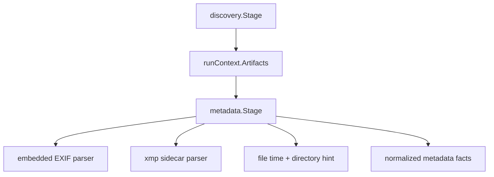

# Implementation Plan: Recover Metadata Facts

**Branch**: `00003-recover-metadata-facts` | **Date**: 2026-04-05 | **Spec**: `specs/00003-recover-metadata-facts/spec.md`

## Summary

**Goal**: Convert discovered image candidates into normalized metadata facts with layered recovery, explicit provenance, and per-metric exclusions.  
**Approach**: Introduce a metadata package under `/src/internal/metadata`, pass discovery outputs through shared run-context artifacts, parse EXIF plus optional XMP sidecars, and apply explicit date and focal-length fallback rules.  
**Key Constraint**: Continue past corrupt or incomplete metadata while preserving an honest record of what was derived, excluded, or missing.

## Technical Context

**Language/Version**: Go 1.24  
**Primary Dependencies**: Go stdlib, `github.com/rwcarlsen/goexif/exif`, existing discovery and pipeline packages  
**Storage**: none  
**Testing**: `go test -race -count=1 ./...`, `go test -tags=integration -count=1 ./...`, `golangci-lint run ./...`, `govulncheck ./...`, `go test -count=1 -coverprofile=coverage.out -coverpkg=./... ./...`  
**Target Platform**: Desktop CLI on macOS, Windows, and Linux  
**Project Type**: single  
**Project Mode**: greenfield extension  
**Performance Goals**: Per-file metadata recovery should remain linear in candidate count and avoid loading more metadata than one file plus optional sidecar at a time  
**Constraints**: Source code under `/src`, offline-only runtime, no source-file mutation, layered fallback order must stay explicit, no run abort on per-file metadata failure  
**Scale/Scope**: One archive scan at a time, embedded EXIF plus optional XMP sidecars, per-metric provenance and exclusions

## Instructions Check

| Principle | Status | Plan Response |
|-----------|--------|---------------|
| Narrow Product Scope | PASS | Limits work to metadata recovery and provenance, not aggregation or report rendering. |
| Local-First Safety | PASS | Reads metadata locally and never mutates source archives or sidecars. |
| Modular Pipeline Design | PASS | Adds a dedicated metadata package and stage fed by discovery artifacts. |
| Honest Data Reporting | PASS | Explicitly models provenance, exclusions, and parse warnings per metric. |
| Cross-Platform Release Quality | PASS | Uses portable file APIs and pure-Go parsing libraries. |

## Architecture



## Architecture Decisions

| ID | Decision | Options Considered | Chosen | Rationale |
|----|----------|--------------------|--------|-----------|
| AD-001 | How should discovery feed metadata recovery? | Re-run discovery / generic stage artifact store / tightly coupled direct calls | Generic stage artifact store on `RunContext` | Keeps stages modular while allowing later waves to reuse prior outputs. |
| AD-002 | How should EXIF parsing be implemented? | Hand-rolled TIFF parsing / external Go library | `goexif` library | Mature enough for the current support matrix and faster than custom parsing. |
| AD-003 | How should XMP be parsed? | Full Adobe schema bindings / generic XML token scan | Generic XML token scan by local element name | Covers the needed fields without overcommitting to the full XMP schema early. |
| AD-004 | How should focal-length normalization behave? | Equivalent only / actual focal length only / equivalent when present, actual as explicit fallback | Equivalent when present, actual focal length as derived fallback | Preserves usability while labeling uncertainty honestly. |

## Data Model Summary

| Entity | Key Fields | Relationships | Notes |
|--------|------------|---------------|-------|
| Fact | path, relative_path, captured_at, camera_model, lens_model, focal_length_mm, normalized_focal_length_mm, aperture_f, shutter_seconds, iso | contains Provenance and Exclusion records | Shared normalized record for later aggregation. |
| Provenance | metric, source | belongs to Fact | Source labels: embedded, sidecar, file_timestamp, directory_hint, derived_actual_focal_length. |
| Exclusion | metric, reason | belongs to Fact | Recorded when a metric remains unavailable after all layers. |
| Result | facts, warnings | produced by metadata.Service | Shared metadata stage output for later aggregation. |

## API Surface Summary

| Method | Path | Purpose | Auth | Req/Res Types |
|--------|------|---------|------|---------------|
| Go | `metadata.NewService` | Build the metadata recovery service | none | `Service` |
| Go | `Service.Recover` | Convert discovery outputs into normalized facts | none | `discovery.Result, sink -> Result, error` |
| Go | `metadata.NewStage` | Adapt metadata recovery into the pipeline stage contract | none | `Service -> pipeline.Stage` |

## Testing Strategy

| Tier | Tool | Scope | Mock Boundary | Install |
|------|------|-------|---------------|---------|
| Unit | `go test -race -count=1 ./...` | EXIF parsing helpers, XMP fallback, provenance labeling, exclusions, directory fallback | Temp files and mock stat hooks | configured |
| Integration | `go test -tags=integration -count=1 ./...` | Full CLI run over real gallery fixture to ensure metadata stage does not abort discovery output | Real gallery fixture, temp sidecar fixtures | configured |
| Static Analysis | `golangci-lint run ./...` | Metadata, discovery, and runner integration packages | none | configured |
| Security | `govulncheck ./...` | Reachable vulnerability scan for the Go module | none | configured |
| Coverage | `go test -count=1 -coverprofile=coverage.out -coverpkg=./... ./...` | Cross-package coverage including metadata recovery and stage artifact store | none | configured |

## Error Handling Strategy

- EXIF decode failures become warnings and trigger sidecar plus fallback recovery for the same file.
- Sidecar parse failures become warnings but do not erase already recovered embedded values.
- Metrics that remain unavailable after all layers become explicit exclusions on the fact rather than stage-level errors.

## Integration Points

| Spec Reference | System/Service | Technical Approach | Contract |
|----------------|----------------|--------------------|----------|
| US1 | E002 discovery output | Read `discovery.Result` from shared run-context artifacts | `src/internal/discovery/` |
| US2 | Sidecar matching | Pair `.xmp` candidates by shared relative-path stem | `src/internal/metadata/service.go` |
| US3 | Later aggregation | Store `metadata.Result` in shared run-context artifacts for E004 | `src/internal/app/context.go` |

## Risk Mitigation

| Risk (from spec) | Likelihood | Impact | Mitigation | Owner |
|-------------------|------------|--------|------------|-------|
| Parser fragility | Medium | High | Wrap EXIF and XMP parsing in warning-first helpers and cover real gallery plus synthetic fixtures. | metadata package |
| Provenance drift | Medium | High | Centralize metric assignment through helper functions that always set source or exclusion. | metadata package |
| Over-normalization | Low | Medium | Distinguish explicit equivalent values from derived actual-focal-length fallback in provenance. | metadata package |

## Requirement Coverage Map

| Req ID | Component(s) | File Path(s) | Notes |
|--------|--------------|--------------|-------|
| FR-001 | EXIF reader, metadata service | `src/internal/metadata/service.go` | Embedded EXIF recovery. |
| FR-002 | XMP parser, sidecar pairing | `src/internal/metadata/xmp.go`, `src/internal/metadata/service.go` | Sidecar supplementation. |
| FR-003 | fallback helpers | `src/internal/metadata/service.go` | File-time and directory-hint date recovery. |
| FR-004 | normalization helpers | `src/internal/metadata/service.go`, `src/internal/metadata/fact.go` | Focal-length normalization with provenance. |
| FR-005 | fact model | `src/internal/metadata/fact.go` | Provenance and exclusions per metric. |
| FR-006 | warning publication, tests | `src/internal/metadata/service.go`, `src/internal/metadata/service_test.go` | Warning-and-continue behavior. |

## Project Structure

### Source Code

```text
src/
  internal/
    app/
      context.go
      context_test.go
    discovery/
      stage.go
    metadata/
      fact.go
      service.go
      service_test.go
      stage.go
      xmp.go
  cmd/
    root.go
```

## Implementation Hints

- **[HINT-001]** Keep metric assignment in one helper so provenance and exclusions cannot drift apart.
- **[HINT-002]** Use the real gallery fixture for embedded EXIF validation and synthetic XMP files for sidecar coverage.
- **[HINT-003]** Keep directory date parsing conservative: prefer full `YYYY_MM_DD` hints, then year-only hints only when needed.
- **[HINT-004]** Store stage outputs in `RunContext` so E004 can reuse them without rerunning prior stages.