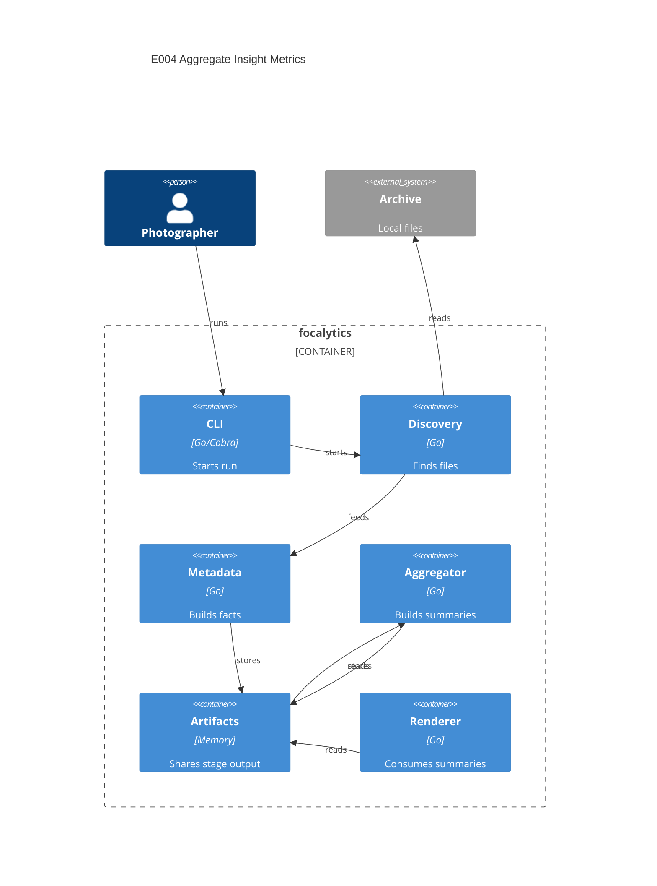

# Implementation Plan: Aggregate Insight Metrics

**Branch**: `00007-aggregate-insight-metrics` | **Date**: 2026-04-05 | **Spec**: `specs/00007-aggregate-insight-metrics/spec.md`

## Summary

**Goal**: Convert normalized metadata facts into deterministic archive-level summaries for timeline, gear, technical metrics, and exclusion visibility.  
**Approach**: Add an `internal/aggregate` package and stage that consumes `metadata.Result`, builds typed in-memory summaries, and stores one aggregate artifact for later rendering.  
**Key Constraint**: Preserve an aggregate-only output model with explicit exclusion counts and no per-photo rendering payloads.

## Technical Context

**Language/Version**: Go 1.24  
**Primary Dependencies**: Go stdlib, Cobra, existing discovery/metadata/pipeline packages  
**Storage**: none  
**Testing**: `go test`, `golangci-lint`, `govulncheck`, coverage profile commands  
**Target Platform**: Desktop CLI on macOS, Windows, and Linux  
**Project Type**: single  
**Project Mode**: brownfield  
**Performance Goals**: Keep aggregation linear in fact count and memory bound to aggregate cardinality rather than file count  
**Constraints**: Offline-only runtime, source under `/src`, stateless per run, deterministic ordering, explicit exclusion visibility  
**Scale/Scope**: One archive run at a time with facts spanning decades and thousands of photos

## Instructions Check

| Principle | Status | Plan Response |
|-----------|--------|---------------|
| Narrow Product Scope | PASS | Limits work to in-memory aggregation and shared summary artifacts, not rendering or metadata parsing. |
| Local-First Safety | PASS | Uses only in-memory processing of prior stage artifacts and does not mutate archives. |
| Modular Pipeline Design | PASS | Adds a dedicated aggregation package and stage under `/src/internal`. |
| Honest Data Reporting | PASS | Preserves warning and exclusion counts in first-class summary models. |
| Cross-Platform Release Quality | PASS | Uses pure-Go runtime logic with no platform-specific dependencies. |

## Architecture



## Architecture Decisions

| ID | Decision | Options Considered | Chosen | Rationale |
|----|----------|--------------------|--------|-----------|
| AD-001 | How should aggregation receive its input? | Re-run metadata / read shared artifact / call service directly from CLI | Read shared `metadata.Result` artifact | Preserves stage boundaries and keeps E004 aligned with the existing pipeline contract. |
| AD-002 | How should summary ordering be defined? | Map iteration / sort during rendering only / canonical keys plus explicit sorting in aggregation | Canonical keys plus explicit sorting in aggregation | Repeated runs must yield stable report inputs before the render layer touches them. |
| AD-003 | How should exclusions be carried forward? | Warnings only / aggregate generic unknowns / aggregate per-metric and per-reason counts | Aggregate per-metric and per-reason counts | E005 needs precise omission context for chart footnotes and summary notes. |

## Data Model Summary

| Entity | Key Fields | Relationships | Notes |
|--------|------------|---------------|-------|
| ArchiveSummary | date_span, totals, timeline, gear, technical, exclusions, warnings_total | owns all summary collections | Shared aggregate artifact for E005. |
| DateSpan | first_captured_at, last_captured_at | belongs to ArchiveSummary | Derived from captured facts only. |
| TimelineBucket | key, label, count | belongs to ArchiveSummary.timeline | Supports year and day summaries. |
| RankedBucket | key, label, count | belongs to gear or technical summaries | Used for camera, lens, and technical buckets. |
| ExclusionSummary | metric, reason, count | belongs to ArchiveSummary.exclusions | Preserves omission transparency by metric family. |

**Detail**: `specs/00007-aggregate-insight-metrics/data-model.md`

## API Surface Summary

N/A — no API surface

## Testing Strategy

| Tier | Tool | Scope | Mock Boundary | Install |
|------|------|-------|---------------|---------|
| Unit | `go test -race -count=1 ./...` | Bucket boundaries, ranking order, exclusion accumulation, empty summaries | Pure in-memory fixtures | configured |
| Integration | `go test -tags=integration -count=1 ./...` | Pipeline execution through metadata and aggregate stages | Real gallery fixture plus synthetic metadata fixtures | configured |
| Security | `govulncheck ./...` | Reachable vulnerabilities in the Go module | — | configured |
| Coverage | `go test -count=1 -coverprofile=coverage.out -coverpkg=./... ./...` | Cross-package coverage for aggregation stage, service, and wiring | — | configured |

## Error Handling Strategy

N/A — aggregation is a local pipeline stage with simple success/failure semantics and warning-first input handling inherited from metadata recovery.

## Integration Points

| Spec Reference | System/Service | Technical Approach | Contract |
|----------------|----------------|--------------------|----------|
| US1 | E003 metadata output | Read `metadata.Result` from run-context artifacts and build date span plus timeline buckets | `src/internal/metadata/` |
| US2 | CLI pipeline | Insert aggregate stage after metadata so summaries are available to later rendering | `src/cmd/root.go`, `src/internal/pipeline/` |
| US3 | E005 rendering | Store `aggregate.Result` in run-context artifacts for later report generation | `src/internal/app/context.go` |

## Risk Mitigation

| Risk (from spec) | Likelihood | Impact | Mitigation | Owner |
|-------------------|------------|--------|------------|-------|
| Bucket drift | Medium | High | Centralize bucket-key creation and ordering helpers in the aggregate package and validate them with boundary-focused tests. | aggregate package |
| Exclusion dilution | Medium | High | Preserve exclusions as structured aggregate rows keyed by metric and reason instead of rolling them into warnings. | aggregate package |
| Memory creep | Low | Medium | Keep aggregate models count-based only and reject file-level payload fields in result types and tests. | aggregate package |

## Requirement Coverage Map

| Req ID | Component(s) | File Path(s) | Notes |
|--------|--------------|--------------|-------|
| FR-001 | aggregate service, summary model | `src/internal/aggregate/service.go`, `src/internal/aggregate/summary.go` | Date span plus year/day bucket aggregation. |
| FR-002 | aggregate service | `src/internal/aggregate/service.go`, `src/internal/aggregate/service_test.go` | Ranked camera and lens summaries with deterministic tie-breaking. |
| FR-003 | aggregate service, bucket helpers | `src/internal/aggregate/service.go`, `src/internal/aggregate/buckets.go` | Technical metric bucketing for focal length, aperture, shutter, and ISO. |
| FR-004 | aggregate result model, aggregate service | `src/internal/aggregate/summary.go`, `src/internal/aggregate/service.go` | Warning totals and exclusion summaries. |
| FR-005 | aggregate stage, run context, command wiring | `src/internal/aggregate/stage.go`, `src/internal/app/context.go`, `src/cmd/root.go` | Shared aggregate artifact stored for later rendering. |
| FR-006 | aggregate result model, tests | `src/internal/aggregate/summary.go`, `src/internal/aggregate/service_test.go` | Aggregate-only output enforced by model shape and tests. |

## Project Structure

### Source Code

```text
src/
  cmd/
    ~ root.go
  internal/
    aggregate/
      + buckets.go
      + service.go
      + service_test.go
      + stage.go
      + summary.go
    app/
      ~ context.go
```

**Patterns to reuse**: Stage-per-capability packages, shared artifact passing through `app.RunContext`, and table-driven unit tests from `internal/discovery` and `internal/metadata`.
**Tests to extend**: `src/cmd/run_integration_test.go` and the new `src/internal/aggregate/service_test.go` stage/service coverage.
**Naming conventions**: Keep package names singular by domain, prefer explicit result types, and use exported artifact constants in `app/context.go`.

## Implementation Hints

- **[HINT-001]** Order: Add the aggregate artifact constant before wiring the new stage so stage tests can use the shared key immediately.
- **[HINT-002]** Gotcha: Do not expose raw maps in the final result type unless the service sorts them into slices before publication.
- **[HINT-003]** Constraint: Empty inputs must still return a valid zero-value summary instead of `nil` sections.
- **[HINT-004]** Performance: Count and group exclusions during the main aggregation pass instead of rescanning facts afterward.