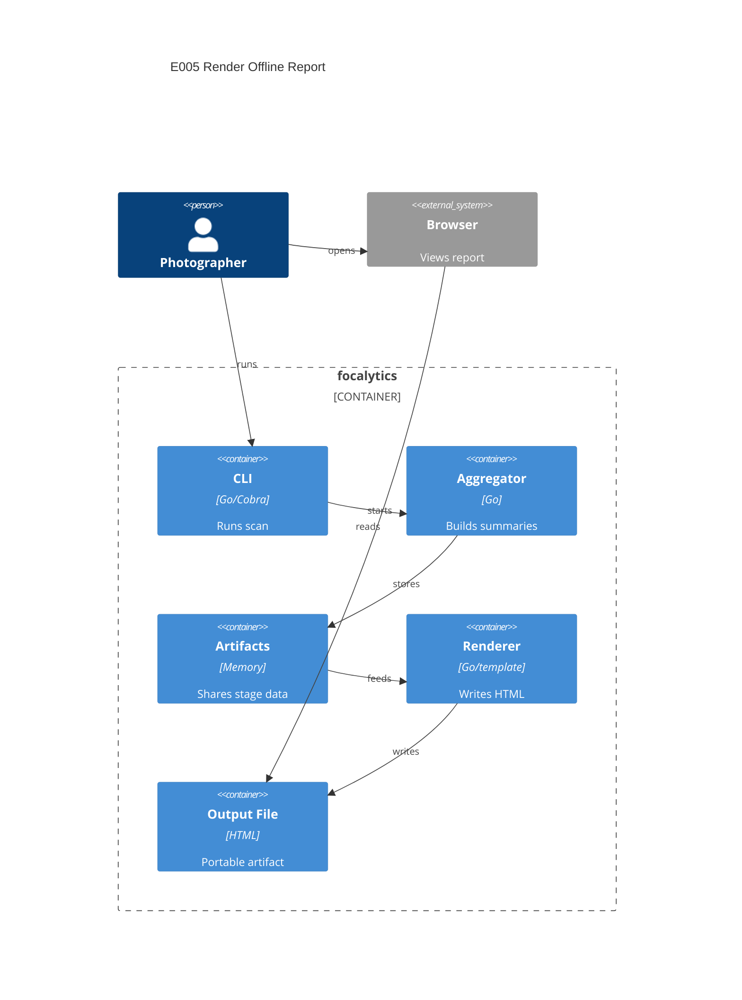

# Implementation Plan: Render Offline Report

**Branch**: `00008-render-offline-report` | **Date**: 2026-04-05 | **Spec**: `specs/00008-render-offline-report/spec.md`

## Summary

**Goal**: Turn aggregate archive summaries into one polished, self-contained HTML report artifact written by the CLI.  
**Approach**: Add an `internal/render` package and pipeline stage that converts aggregate summaries into a report model, renders embedded HTML/CSS with inline SVG, writes a timestamped file, and prints the resulting path.  
**Key Constraint**: Keep the output offline and portable as a single `.html` file with no external assets or browser-side library dependencies.

## Technical Context

**Language/Version**: Go 1.24  
**Primary Dependencies**: Go stdlib, Cobra, existing discovery/metadata/aggregate/pipeline packages, `html/template`, `embed`  
**Storage**: local filesystem output file only  
**Testing**: `go test`, `golangci-lint`, `govulncheck`, coverage profile commands, golden-file report tests  
**Target Platform**: Desktop CLI on macOS, Windows, and Linux  
**Project Type**: single  
**Project Mode**: brownfield  
**Performance Goals**: Render one report without re-reading file-level facts and keep output generation bounded to aggregate summary size  
**Constraints**: Offline-only runtime, source under `/src`, one HTML artifact, no CDN or external JS chart libraries, explicit output-path reporting  
**Scale/Scope**: One archive run at a time producing one report artifact from in-memory aggregate summaries

## Instructions Check

| Principle | Status | Plan Response |
|-----------|--------|---------------|
| Narrow Product Scope | PASS | Limits work to the final offline report artifact and excludes interactive editing or cloud workflows. |
| Local-First Safety | PASS | Reads only aggregate artifacts and writes one local report file without network calls. |
| Modular Pipeline Design | PASS | Adds a dedicated rendering package and stage under `/src/internal`. |
| Honest Data Reporting | PASS | Requires exclusion notes per affected section and explicit render-failure behavior. |
| Cross-Platform Release Quality | PASS | Uses pure-Go templating and filesystem APIs suitable for macOS, Windows, and Linux. |

## Architecture



## Architecture Decisions

| ID | Decision | Options Considered | Chosen | Rationale |
|----|----------|--------------------|--------|-----------|
| AD-001 | How should the report be rendered? | raw string concatenation / `text/template` / `html/template` with embedded assets | `html/template` with embedded template and inline CSS | Preserves HTML safety and keeps the artifact self-contained in the binary. |
| AD-002 | How should charts be produced offline? | external JS chart library / canvas scripts / inline SVG plus semantic HTML | Inline SVG plus semantic HTML | Satisfies the no-library offline constraint while keeping labels readable. |
| AD-003 | How should default output naming work? | random temp file / archive-slug file / timestamped cwd artifact | Timestamped file in current working directory | Matches the product brief’s one-command output behavior and keeps discovery simple. |

## Data Model Summary

| Entity | Key Fields | Relationships | Notes |
|--------|------------|---------------|-------|
| ReportModel | title, generated_at, archive_overview, timeline, gear, technical, exclusion_notes, report_path | owns section views | Render-ready model derived from aggregate summaries. |
| OverviewCard | label, value, supporting_text | belongs to ReportModel.archive_overview | Hero metrics and trophies. |
| ChartBlock | title, subtitle, svg_markup, table_rows, exclusion_note | belongs to timeline, gear, or technical sections | Reusable visual/content block. |
| ExclusionNote | section_key, text, details | belongs to ReportModel.exclusion_notes | Visible explanation of missing data. |
| RenderResult | path, generated_at | produced by render stage | Final artifact metadata for success reporting. |

**Detail**: `specs/00008-render-offline-report/data-model.md`

## API Surface Summary

N/A — no API surface

## Testing Strategy

| Tier | Tool | Scope | Mock Boundary | Install |
|------|------|-------|---------------|---------|
| Unit | `go test -race -count=1 ./...` | Report model mapping, filename generation, exclusion-note rendering, empty-state behavior | Temp dirs, injected clock, in-memory aggregate fixtures | configured |
| Integration | `go test -tags=integration -count=1 ./...` | Full CLI run producing one HTML artifact and report-path output | Real gallery fixture and temporary working directory | configured |
| Security | `govulncheck ./...` | Reachable vulnerabilities in the Go module | — | configured |
| Coverage | `go test -count=1 -coverprofile=coverage.out -coverpkg=./... ./...` | Cross-package coverage for render service, stage wiring, and command behavior | — | configured |

## Error Handling Strategy

N/A — rendering is a local pipeline stage with fail-fast file-write behavior and explicit command errors instead of API-style responses.

## Integration Points

| Spec Reference | System/Service | Technical Approach | Contract |
|----------------|----------------|--------------------|----------|
| US1 | E004 aggregate output | Read `aggregate.Result` from run-context artifacts and convert it into a report model | `src/internal/aggregate/` |
| US2 | CLI runtime | Add render stage after aggregation and print the report path after successful file creation | `src/cmd/run.go`, `src/internal/pipeline/` |
| US3 | Browser runtime | Emit one standards-based HTML artifact with inline CSS and SVG so local browsers can open it directly | `src/internal/render/` |

## Risk Mitigation

| Risk (from spec) | Likelihood | Impact | Mitigation | Owner |
|-------------------|------------|--------|------------|-------|
| Template drift | Medium | High | Keep a typed report model boundary and cover it with golden and structural render tests before CLI integration. | render package |
| Visual ambiguity | Medium | Medium | Use semantic section headings, visible tables/labels, and explicit exclusion notes alongside charts. | render package |
| Artifact fragility | Low | High | Embed template assets, generate one `.html` file, and verify offline output behavior in integration tests. | render package |

## Requirement Coverage Map

| Req ID | Component(s) | File Path(s) | Notes |
|--------|--------------|--------------|-------|
| FR-001 | render service, render stage | `src/internal/render/service.go`, `src/internal/render/stage.go` | One HTML artifact rendered from aggregate summaries. |
| FR-002 | render service, filename helpers | `src/internal/render/service.go`, `src/internal/render/path.go` | Timestamped `.html` output in working directory. |
| FR-003 | report model, templates | `src/internal/render/model.go`, `src/internal/render/templates/report.html.tmpl` | Overview, timeline, gear, and technical sections from aggregate-only data. |
| FR-004 | embedded assets, render service | `src/internal/render/assets.go`, `src/internal/render/templates/report.html.tmpl`, `src/internal/render/templates/report.css` | Inline CSS/assets for offline viewing. |
| FR-005 | report model, templates, tests | `src/internal/render/model.go`, `src/internal/render/templates/report.html.tmpl`, `src/internal/render/service_test.go` | Exclusion notes surfaced per affected section. |
| FR-006 | run handler, render service, integration tests | `src/cmd/run.go`, `src/internal/render/service.go`, `src/cmd/run_integration_test.go` | Report path output and clear write failure behavior. |

## Project Structure

### Source Code

```text
src/
  cmd/
    ~ root.go
    ~ run.go
    ~ run_integration_test.go
  internal/
    app/
      ~ context.go
    render/
      + assets.go
      + model.go
      + path.go
      + service.go
      + service_test.go
      + stage.go
      + templates/report.css
      + templates/report.html.tmpl
```

**Patterns to reuse**: Pipeline stage-per-capability packages, artifact passing through `app.RunContext`, and table-driven tests from `internal/metadata` and `internal/aggregate`.
**Tests to extend**: `src/cmd/run_integration_test.go`, `src/cmd/run_test.go`, and new golden/structural tests in `src/internal/render/service_test.go`.
**Naming conventions**: Keep output/result types explicit, keep template assets under the owning package, and prefer injected helpers for time and working-directory behavior.

## Implementation Hints

- **[HINT-001]** Order: Add the render artifact key and stage wiring before asserting CLI output so integration tests observe the real end-of-pipeline behavior.
- **[HINT-002]** Gotcha: Normalize timestamps in tests so golden HTML remains deterministic even though filenames are time-based.
- **[HINT-003]** Constraint: Build charts from aggregate slices only; do not reintroduce per-photo records into the report model.
- **[HINT-004]** Compatibility: Use `filepath`-based path generation and avoid hard-coded separators in filenames or links.
- **[HINT-005]** UX: Keep exclusion notes visible in text even when a section also includes a chart or leaderboard.