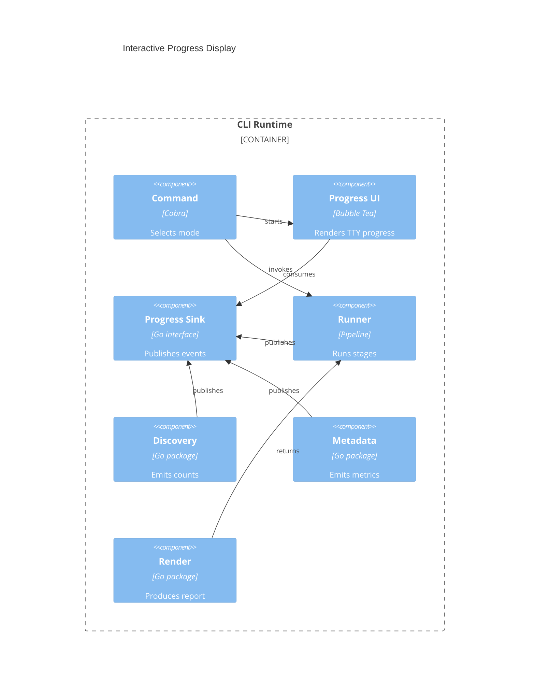

# Implementation Plan: Interactive Progress Display

**Branch**: `00009-interactive-progress-display` | **Date**: 2026-04-05 | **Spec**: `specs/00009-interactive-progress-display/spec.md`

## Summary

**Goal**: Replace noisy per-file progress output with a stage-aware interactive terminal experience while preserving clean scripted output.  
**Approach**: Extend the existing progress-event contract, add a Bubble Tea sink for TTY runs, and remove routine per-file stdout/stderr chatter from discovery and render paths.  
**Key Constraint**: Preserve the current single-binary, offline CLI contract and keep the report path as the sole stdout success output.

## Technical Context

**Language/Version**: Go 1.25.8  
**Primary Dependencies**: Cobra, Bubble Tea, Bubbles, Go stdlib runtime packages, `golang.org/x/term`  
**Storage**: N/A  
**Testing**: `go test ./...`, integration tests in `src/cmd`, `golangci-lint run ./...`, `govulncheck ./...`, `go test -coverpkg=./... ./...`  
**Target Platform**: Desktop CLI on macOS, Windows, and Linux  
**Project Type**: single  
**Project Mode**: brownfield  
**Performance Goals**: Keep progress feedback readable on archives with tens of thousands of files, avoid per-file redraw churn, and preserve negligible overhead relative to scan time  
**Constraints**: `/src` source layout, offline-only runtime, no source archive mutation, TTY-safe interactive mode, non-interactive-safe fallback output  
**Scale/Scope**: One archive run at a time across discovery, metadata, aggregation, and render stages

## Instructions Check

| Principle | Status | Plan Response |
|-----------|--------|---------------|
| Narrow Product Scope | PASS | Limits the work to terminal progress UX and output-contract cleanup. |
| Local-First Safety | PASS | Keeps all execution local and read-only. |
| Modular Pipeline Design | PASS | Extends the progress sink and runner boundaries instead of embedding UI logic in stages. |
| Honest Data Reporting | PASS | Preserves readable warnings and explicit final status. |
| Cross-Platform Release Quality | PASS | Uses cross-platform terminal detection and Go libraries already aligned with the architecture. |

## Architecture



## Architecture Decisions

| ID | Decision | Options Considered | Chosen | Rationale |
|----|----------|--------------------|--------|-----------|
| AD-001 | How should interactive mode be detected? | Always enable TUI / infer from flags / explicit TTY detection | Explicit TTY detection | Protects piped and redirected runs from redraw noise. |
| AD-002 | How should progress be modeled for the UI? | Per-file text lines / stage lifecycle plus aggregate metrics | Stage lifecycle plus aggregate metrics | Matches the UX goal without recreating the current spam problem. |
| AD-003 | Where should Bubble Tea integrate? | Inside stages / above the sink interface / replace runner | Above the sink interface | Keeps runtime modules decoupled and testable. |
| AD-004 | What survives on stdout? | Existing candidate/report lines / report path only | Report path only | Preserves a durable, script-friendly success contract. |

## Data Model Summary

N/A — no persistent data

## API Surface Summary

| Method | Path | Purpose | Auth | Req/Res Types |
|--------|------|---------|------|---------------|
| Go | `progress.TUISink.Publish` | Forward progress events into the interactive program | none | `Event -> error/none` |
| Go | `progress.NewTUIModel` | Build the interactive progress state machine | none | `runner, request -> model` |
| Go | `pipeline.Runner.Run` | Publish stage lifecycle events around stage execution | none | `ScanRequest -> RunResult, error` |
| Go | `metadata.Service.Recover` | Publish aggregate processing progress for metadata work | none | `Result, sink -> Result, error` |

**Detail**: `specs/00009-interactive-progress-display/contracts/`

## Testing Strategy

| Tier | Tool | Scope | Mock Boundary | Install |
|------|------|-------|---------------|---------|
| Unit | `go test ./...` | Progress model state transitions, sink publishing, event formatting, TTY-mode selection helpers | Bubble Tea model messages, sink doubles, filesystem-free stage stubs | configured |
| Integration | `go test ./...` | CLI execution in interactive and non-interactive paths, stdout/stderr contracts, report-path behavior | Temp archives and fake runners only | configured |
| Security | `govulncheck ./...` | Dependency and reachable-code scan after adding Bubble Tea dependencies | — | configured |
| Coverage | `go test -coverpkg=./... ./...` | Cross-package coverage for progress, runner, command, discovery, metadata, and render regressions | — | configured |

## Error Handling Strategy

N/A — existing CLI exit codes and stderr warning/error channels remain the runtime error contract for this feature

## Risk Mitigation

| Risk (from spec) | Likelihood | Impact | Mitigation | Owner |
|-------------------|------------|--------|------------|-------|
| TTY detection drift | Medium | High | Centralize terminal detection in the command/runtime boundary and cover redirected-output cases with tests. | cmd/progress |
| Stage visibility gaps | Medium | Medium | Add explicit stage start/end and processed-total events in the runner and metadata service. | pipeline/progress |
| Regression in output contracts | Medium | High | Remove candidate/report chatter intentionally, codify the report-path-only stdout contract, and update integration tests. | cmd/render/discovery |

## Requirement Coverage Map

| Req ID | Component(s) | File Path(s) | Notes |
|--------|--------------|--------------|-------|
| FR-001 | command mode switch, TUI sink, TUI model | `src/cmd/root.go`, `src/internal/progress/tui.go` | Interactive TTY path replaces per-file lines. |
| FR-002 | runner lifecycle events, TUI model | `src/internal/pipeline/runner.go`, `src/internal/progress/event.go`, `src/internal/progress/tui.go` | Stage-level status for all pipeline phases. |
| FR-003 | discovery metrics, metadata metrics | `src/internal/discovery/service.go`, `src/internal/metadata/service.go`, `src/internal/progress/event.go` | Aggregate counters rather than per-file chatter. |
| FR-004 | terminal detection, non-interactive sink selection | `src/cmd/root.go`, `src/internal/progress/noop.go` | Disable interactive rendering when not on a TTY. |
| FR-005 | non-interactive output policy | `src/cmd/root.go`, `src/internal/discovery/service.go`, `src/internal/render/service.go` | Quiet non-interactive success path. |
| FR-006 | render result handoff, CLI final output | `src/internal/render/service.go`, `src/cmd/root.go`, `src/cmd/run_test.go` | Report path remains sole stdout success output. |
| FR-007 | warning rendering, runner error path | `src/internal/progress/tui.go`, `src/internal/pipeline/runner.go`, `src/internal/metadata/service.go` | Warnings and fatal errors stay explicit. |
| FR-008 | discovery/render stdout cleanup | `src/internal/discovery/service.go`, `src/internal/render/service.go`, `src/cmd/run_integration_test.go` | Remove candidate-listing defaults. |
| FR-009 | TUI warning persistence | `src/internal/progress/tui.go`, `src/internal/progress/tui_test.go` | Warnings must survive redraws. |

## Project Structure

### Source Code

```text
src/
  cmd/
    ~ root.go
    ~ run_integration_test.go
    ~ run_test.go
  ~ go.mod
  internal/
    discovery/
      ~ service.go
      ~ service_test.go
    metadata/
      ~ service.go
      ~ service_test.go
    pipeline/
      ~ runner.go
      ~ runner_test.go
    progress/
      ~ event.go
      ~ text.go
      ~ text_test.go
      + tui.go
      + tui_test.go
    render/
      ~ service.go
      ~ service_test.go
specs/00009-interactive-progress-display/
  + contracts/runtime-progress-contracts.md
```

**Patterns to reuse**: Existing `progress.Sink` abstraction, stage/result contracts, and command wiring through `cmd.Execute`.  
**Tests to extend**: `src/cmd/run_integration_test.go`, `src/cmd/run_test.go`, `src/internal/discovery/service_test.go`, `src/internal/pipeline/runner_test.go`, `src/internal/render/service_test.go`.  
**Naming conventions**: Keep package-focused filenames, constructor-style `New...` functions, and typed stage/service pairs under `src/internal`.

## Implementation Hints

- **[HINT-001]** Order: Extend `progress.Event` before wiring the TUI so stage and metric events have stable fields.
- **[HINT-002]** Constraint: Preserve the `progress.Sink` interface so non-interactive and test doubles continue to compile.
- **[HINT-003]** Gotcha: Removing per-file stdout output requires updating integration tests that currently assert on candidate lines.
- **[HINT-004]** Compatibility: Gate the Bubble Tea path behind TTY detection so Windows, macOS, Linux, and CI logs stay valid.
- **[HINT-005]** Performance: Rate-limit metadata progress updates enough to avoid overwhelming the TUI message loop on large archives.
