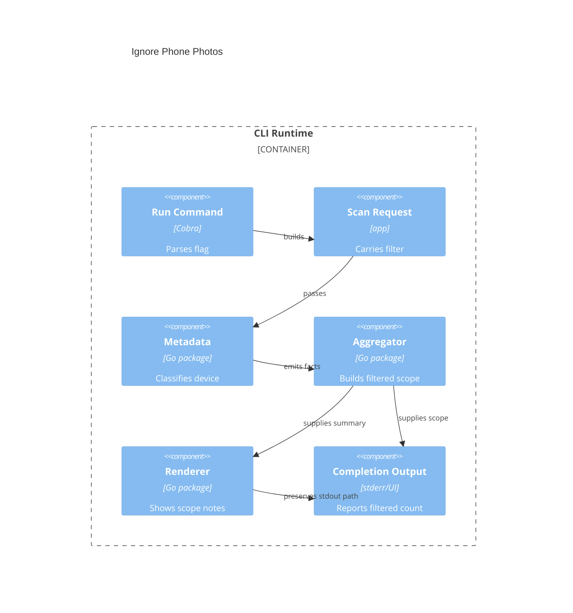

# Implementation Plan: Ignore Phone Photos

**Branch**: `00010-ignore-phone-photos` | **Date**: 2026-04-08 | **Spec**: `specs/00010-ignore-phone-photos/spec.md`

## Summary

**Goal**: Add an opt-in runtime filter that removes confidently identified phone-made photos from gear and technical analytics while preserving the current default CLI behavior.  
**Approach**: Extend the scan request and metadata fact contracts with filter and classification state, compute filtered scope once in aggregation, and surface that scope consistently in report rendering and terminal completion feedback.  
**Key Constraint**: Keep the report path as the sole stdout success output and avoid speculative exclusion when metadata evidence is weak.

## Technical Context

**Language/Version**: Go 1.25.9  
**Primary Dependencies**: Cobra, Bubble Tea, Go stdlib runtime packages, `github.com/rwcarlsen/goexif`  
**Storage**: N/A  
**Testing**: `go test ./...`, `golangci-lint run ./...`, `govulncheck ./...`, `go test -coverpkg=./... ./...`  
**Target Platform**: Desktop CLI on macOS, Windows, and Linux  
**Project Type**: single  
**Project Mode**: brownfield  
**Performance Goals**: Keep phone classification and filtered-scope accounting negligible relative to existing metadata recovery and aggregation work on large archives  
**Constraints**: `/src` source layout, offline-only runtime, no source archive mutation, conservative metadata classification, stdout success contract preserved  
**Scale/Scope**: One archive run at a time across tens of thousands of photos with full-archive timeline totals and filtered gear or technical analytics

## Instructions Check

| Principle | Status | Plan Response |
|-----------|--------|---------------|
| Narrow Product Scope | PASS | Limits work to opt-in filtered archive insight; no broader device taxonomy or timeline rewrite. |
| Local-First Safety | PASS | Keeps classification and filtering local, read-only, and metadata-driven. |
| Modular Pipeline Design | PASS | Extends request, metadata, aggregate, render, and command contracts without collapsing pipeline boundaries. |
| Honest Data Reporting | PASS | Binds filtered counts to one shared summary used by render and terminal feedback. |
| Cross-Platform Release Quality | PASS | Preserves existing CLI contracts and avoids platform-specific output changes. |

## Architecture



## Architecture Decisions

| ID | Decision | Options Considered | Chosen | Rationale |
|----|----------|--------------------|--------|-----------|
| AD-001 | Where does filter enablement live? | Command-local flag only / `ScanRequest` field / environment variable | `ScanRequest` field | Keeps the filter explicit across pipeline boundaries and testable in brownfield services. |
| AD-002 | Where is phone classification computed? | Recompute in aggregation / attach classification during metadata recovery / infer in render | Attach classification during metadata recovery | Creates one trustworthy source of truth for downstream filtering and disclosure. |
| AD-003 | What analytics should the filter change? | Whole report / gear and technical only / technical only | Gear and technical plus derived hero rankings only | Matches clarified scope while keeping timeline and totals stable. |
| AD-004 | How is filtered scope disclosed? | Stdout summary / stderr or UI plus report notes / report only | stderr or UI plus overview and section report notes | Preserves scriptability and keeps changed scope visible where interpretation changes. |

## Data Model Summary

| Entity | Key Fields | Relationships | Notes |
|--------|------------|---------------|-------|
| AnalysisFilter | `ignore_phone_photos` | attached to `ScanRequest` | Default `false` preserves current behavior. |
| DeviceClassification | `kind`, `evidence_source`, `camera_model` | attached to `metadata.Fact` | `unknown` on weak or conflicting evidence. |
| FilteredScopeSummary | `filter_active`, `filtered_photos`, `affected_sections` | derived from aggregate result | Shared by render and terminal completion output. |
| FilteredMetricSection | `section_key`, `eligible_count`, `scope_note`, `empty_state` | nested in render model | Supports empty-state rendering after filtering. |

**Detail**: `specs/00010-ignore-phone-photos/data-model.md`

## API Surface Summary

| Method | Path | Purpose | Auth | Req/Res Types |
|--------|------|---------|------|---------------|
| Go | `app.ScanRequest` | Carry the opt-in filter through the runtime | none | `IgnorePhonePhotos` input |
| Go | `metadata.Service.Recover` | Attach device classification to recovered facts | none | `Candidate set -> metadata.Result` |
| Go | `aggregate.Service.Aggregate` | Produce filtered gear or technical summaries and shared filter counts | none | `metadata.Result + filter -> aggregate.Result` |
| Go | `render.Service.Generate` | Render overview and section scope notes without changing stdout path rules | none | `aggregate.Result -> render.Result` |

**Detail**: `specs/00010-ignore-phone-photos/contracts/`

## Testing Strategy

| Tier | Tool | Scope | Mock Boundary | Install |
|------|------|-------|---------------|---------|
| Unit | `go test ./...` | Flag parsing, device classification, filtered aggregation math, render model notes, empty states | Temp fixtures, writer doubles, injected clocks only | configured |
| Integration | `go test ./...` | CLI runs with and without the phone filter, stdout/stderr contract, filtered report output | Temp archives and golden HTML only | configured |
| Security | `govulncheck ./...` | Dependency and reachable-code scan after contract changes | — | configured |
| Coverage | `go test -coverpkg=./... ./...` | Cross-package coverage for cmd, metadata, aggregate, render, and progress interactions | — | configured |

## Error Handling Strategy

N/A — existing CLI exit codes, warnings, and exclusion disclosures remain the runtime error contract for this feature

## Risk Mitigation

| Risk (from spec) | Likelihood | Impact | Mitigation | Owner |
|-------------------|------------|--------|------------|-------|
| False-positive filtering | Medium | High | Centralize classification rules in metadata recovery, allow only trusted device identity evidence, and add negative tests for ambiguous files. | metadata |
| Scope mismatch across layers | Medium | High | Compute filtered counts once in aggregation and consume the same summary in render and terminal completion paths. | aggregate/render |
| Sparse filtered results | Medium | Medium | Add explicit empty-state render paths and integration coverage for archives where filtered sections have zero eligible photos. | render |

## Requirement Coverage Map

| Req ID | Component(s) | File Path(s) | Notes |
|--------|--------------|--------------|-------|
| FR-001 | run command, request contract | `src/cmd/run.go`, `src/cmd/run_test.go`, `src/internal/app/request.go` | Add one opt-in flag and carry it through the request. |
| FR-002 | run command, integration tests | `src/cmd/run.go`, `src/cmd/run_integration_test.go` | Guard default unfiltered behavior. |
| FR-003 | metadata classifier | `src/internal/metadata/service.go`, `src/internal/metadata/camera_profiles.go`, `src/internal/metadata/fact.go` | Trusted make/model evidence only. |
| FR-004 | metadata classifier tests | `src/internal/metadata/service.go`, `src/internal/metadata/service_test.go` | Unknown classification keeps files included. |
| FR-005 | filtered aggregation and hero derivation | `src/internal/aggregate/service.go`, `src/internal/aggregate/summary.go`, `src/internal/render/service.go` | Filter only gear, technical, and derived hero rankings. |
| FR-006 | aggregate totals and timeline behavior | `src/internal/aggregate/service.go`, `src/internal/aggregate/summary.go`, `src/internal/render/service.go` | Preserve full-archive totals and timeline/date span. |
| FR-007 | render model, template, report tests | `src/internal/render/model.go`, `src/internal/render/service.go`, `src/internal/render/templates/report.html.tmpl`, `src/internal/render/service_test.go` | Always-visible overview and affected-section scope notes. |
| FR-008 | completion output contract | `src/cmd/run.go`, `src/cmd/run_integration_test.go`, `src/internal/progress/tui.go` | Report path remains sole stdout success output. |
| FR-009 | filtered empty states | `src/internal/render/model.go`, `src/internal/render/service.go`, `src/internal/render/service_test.go` | Render valid empty sections after filtering. |
| FR-010 | metadata classifier safeguards | `src/internal/metadata/service.go`, `src/internal/metadata/camera_profiles.go`, `src/internal/metadata/service_test.go` | Reject software-tag and heuristic-only classification. |

## Project Structure

### Source Code

```text
src/
  cmd/
    ~ run.go
    ~ run_test.go
    ~ run_integration_test.go
  internal/
    app/
      ~ request.go
    aggregate/
      ~ service.go
      ~ summary.go
      ~ service_test.go
    metadata/
      ~ camera_profiles.go
      ~ fact.go
      ~ service.go
      ~ service_test.go
    progress/
      ~ tui.go
    render/
      ~ model.go
      ~ service.go
      ~ service_test.go
      ~ templates/report.html.tmpl
specs/00010-ignore-phone-photos/
  + data-model.md
  + contracts/runtime-filter-contracts.md
```

**Patterns to reuse**: `ScanRequest` as the runtime input contract, metadata fact enrichment before aggregation, and render-model-first HTML generation.  
**Tests to extend**: `src/cmd/run_test.go`, `src/cmd/run_integration_test.go`, `src/internal/metadata/service_test.go`, `src/internal/aggregate/service_test.go`, `src/internal/render/service_test.go`.  
**Naming conventions**: Keep package-scoped types, constructor-style helpers, and explicit summary structs under `src/internal`.

## Implementation Hints

- **[HINT-001]** Order: Add the request flag and request field before changing metadata or aggregation so tests can drive the full path.
- **[HINT-002]** Constraint: Compute phone classification once on `metadata.Fact`; do not re-derive it in aggregation or rendering.
- **[HINT-003]** Gotcha: Preserve whole-archive timeline and total-photo reporting even when hero rankings use filtered gear or technical summaries.
- **[HINT-004]** Compatibility: Keep filter-specific completion summaries off stdout so shell capture remains `path=$(focalytics ...)` compatible.
- **[HINT-005]** Performance: Avoid extra full-pass scans; reuse the existing metadata and aggregation pass for classification and counting.