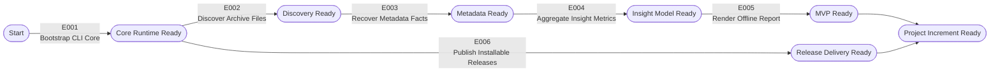

# Project Implementation Plan

> Product: focalytics | Created: 2026-04-05 | Status: Draft | Total Epics: 6 (P1: 5, P2: 1, P3: 0) | Waves: 5

## Epic Checklist

### Wave 1 — Foundation

> Establish the single-binary application skeleton, shared module contracts, and testable command lifecycle that every later increment relies on.

- [X] E001 [P1] [TECHNICAL] {SAD:ADR-001,ADR-002} Bootstrap CLI Core — establish the single-binary /src layout, command entrypoint, pipeline contracts, and shared test harness.

### Wave 2 — Discovery And Delivery

> File discovery and release automation can proceed in parallel once the executable skeleton and build contract exist.

- [X] E002 [P1] [PRODUCT] [P] {PRD:CAP-001}{SAD:ADR-001,ADR-002} Discover Archive Files — implement recursive traversal, file candidate filtering, deterministic scan boundaries, and live progress accounting.
- [X] E006 [P2] [TECHNICAL] [P] {PRD:CAP-007}{SAD:ADR-005} Publish Installable Releases — automate cross-platform builds, checksums, and package-manager metadata from immutable release artifacts.

### Wave 3 — Metadata Recovery

> This wave turns discovered files into trustworthy normalized facts while preserving provenance and exclusion visibility.

- [X] E003 [P1] [PRODUCT] {PRD:CAP-002,CAP-006}{SAD:ADR-003} Recover Metadata Facts — extract EXIF and XMP metadata, apply defined fallbacks, and record per-metric exclusions.

### Wave 4 — Insight Aggregation

> Once normalized facts exist, the product can derive stable archive-level summaries without introducing persistent storage.

- [ ] E004 [P1] [PRODUCT] {PRD:CAP-004,CAP-005,CAP-006}{SAD:ADR-002,ADR-003} Aggregate Insight Metrics — build in-memory summaries for timeline, gear, exposure, and data-quality dimensions.

### Wave 5 — User-Facing Report

> The final MVP wave converts aggregates into the self-contained offline report that users can open locally.

- [ ] E005 [P1] [PRODUCT] {PRD:CAP-003,CAP-004,CAP-005,CAP-006}{SAD:ADR-004} Render Offline Report — generate the self-contained HTML dashboard with summary sections, charts, and exclusion footnotes.

## Dependency Diagram

## Execution Wave Summary

| Wave | Epics | All Parallel? | Notes |
|------|-------|---------------|-------|
| 1 | E001 | No | Foundation wave; every later epic depends on its module and command contracts. |
| 2 | E002, E006 | Yes | E002 and E006 share the build contract from E001 but do not depend on each other. |
| 3 | E003 | No | Metadata layering depends on discovery output and file candidate rules from E002. |
| 4 | E004 | No | Aggregate structures depend on normalized facts and exclusion signals from E003. |
| 5 | E005 | No | Report rendering depends on stable aggregate models and exclusion counters from E004. |

## Parallel Execution Guidance

### Independent Epics

- E002 and E006 can run in parallel after E001 because one extends runtime discovery behavior while the other establishes delivery automation from the shared build contract.

### Integration Risks

- E002 and E006 both rely on the binary name, target matrix, and default command contract defined in E001; changing those interfaces mid-wave will force rework in release automation.
- E003 and E004 share ownership of fact and aggregate schemas; if exclusion semantics drift, the report layer will misstate data quality.
- E004 and E005 share the report model boundary; chart bucket names and exclusion counters must stabilize before HTML templates are finalized.

### Shared Resource Conflicts

- The CLI command surface introduced in E001 is a shared contract for all later epics and should be versioned conservatively.
- Release metadata in E006 must not invent artifact names or checksum layouts that diverge from the actual build outputs produced by the core runtime.
- Aggregate model changes in E004 should land behind explicit shared types to avoid hidden coupling with E005 templates.

## Epic Details

### E001 — Bootstrap CLI Core

- **Category**: TECHNICAL
- **Priority**: P1
- **Source**: {SAD:ADR-001,ADR-002}
- **Scope**: Create the initial single-binary application structure under /src with a stable command entrypoint, shared run context, pipeline interfaces, and baseline test harness. This epic defines the architectural seams that later epics use for discovery, parsing, aggregation, rendering, and progress reporting.
- **Actors**: Developer, photographer
- **Key entities**: Scan request, run context, command configuration, pipeline interface
- **Depends on**: None
- **Dependency contracts**: None
- **Depended on by**: E002, E003, E004, E005, E006
- **Produces (shared)**: CLI entrypoint, module boundaries, shared types, base test command, exit-code contract
- **Constraints**: Must preserve a single executable, keep all source code under /src, and avoid introducing persistent state.
- **Acceptance criteria**:
  - [ ] The repository has a buildable Go application structure under /src with dedicated packages for command handling, discovery, metadata recovery, aggregation, rendering, and progress orchestration.
  - [ ] The binary accepts a target directory argument and returns deterministic exit codes for success, invalid input, and fatal runtime failure.
  - [ ] A baseline automated test command runs successfully against the foundational packages and is suitable for CI reuse.
- **Specify input**:
  - **Description**: Establish the implementation skeleton and command contract for the local modular monolith.
  - **Actors**: Developer, photographer
  - **Key entities**: Scan request, run context, pipeline interface
  - **Depends on artifacts**: specs/prd.md, specs/sad.md
  - **Constraints**: Single binary, offline runtime, no persistent database, /src source layout
  - **Pipeline hints**: lightweight

### E002 — Discover Archive Files

- **Category**: PRODUCT
- **Priority**: P1
- **Source**: {PRD:CAP-001}{SAD:ADR-001,ADR-002}
- **Scope**: Implement recursive archive traversal, candidate-file filtering, root-path validation, and progress accounting that remains responsive during large scans. This epic delivers the first user-visible increment: focalytics can walk a real archive deterministically and report what it is doing.
- **Actors**: Photographer
- **Key entities**: Archive root, file candidate, sidecar candidate, progress snapshot
- **Depends on**: E001
- **Dependency contracts**: Requires the CLI entrypoint, run context, and exit-code contract from E001.
- **Depended on by**: E003
- **Produces (shared)**: Discovery service, file candidate model, progress events, traversal policy
- **Constraints**: Must remain offline, avoid symlink surprises unless explicitly handled, and continue only when the archive root is valid.
- **Acceptance criteria**:
  - [ ] Given a valid archive path, the binary traverses nested directories and emits deterministic file candidates for supported image and sidecar discovery.
  - [ ] The runtime surfaces current path, throughput, and progress state without blocking traversal or requiring a second process.
  - [ ] Invalid root paths fail fast with a clear error while unreadable child entries are tracked as warnings instead of aborting the run.
- **Specify input**:
  - **Description**: Deliver recursive discovery and scan-progress behavior for real local archives.
  - **Actors**: Photographer
  - **Key entities**: Archive root, file candidate, sidecar candidate, progress snapshot
  - **Depends on artifacts**: E001 shared runtime contracts
  - **Constraints**: Zero-config invocation, deterministic traversal, bounded warning handling

### E003 — Recover Metadata Facts

- **Category**: PRODUCT
- **Priority**: P1
- **Source**: {PRD:CAP-002,CAP-006}{SAD:ADR-003}
- **Scope**: Read embedded metadata and matching XMP sidecars, apply fallback date and normalization strategies, and retain provenance plus exclusion details per metric. This epic turns raw files into trustworthy photo facts without pretending metadata quality is uniform.
- **Actors**: Photographer
- **Key entities**: Metadata fact, provenance record, exclusion record, normalization input
- **Depends on**: E002
- **Dependency contracts**: Requires file candidate and sidecar correlation outputs from E002.
- **Depended on by**: E004
- **Produces (shared)**: Normalized fact model, exclusion counters, provenance rules, parser boundary
- **Constraints**: Must not mutate source files, must continue past corrupt metadata, and must keep fallback ordering explicit.
- **Acceptance criteria**:
  - [ ] Embedded EXIF/IPTC metadata is parsed when available and matched XMP sidecars are consulted when embedded data is missing or incomplete.
  - [ ] Defined fallback rules produce partial facts when canonical metadata is absent, while the affected metrics are marked as derived or excluded.
  - [ ] Corrupt or unsupported files emit warnings and exclusion records without aborting the run.
- **Specify input**:
  - **Description**: Convert discovered files into normalized, provenance-aware metadata facts.
  - **Actors**: Photographer
  - **Key entities**: Metadata fact, provenance record, exclusion record, normalization input
  - **Depends on artifacts**: E002 discovery outputs
  - **Constraints**: Layered recovery order, explicit exclusions, no file mutation

### E004 — Aggregate Insight Metrics

- **Category**: PRODUCT
- **Priority**: P1
- **Source**: {PRD:CAP-004,CAP-005,CAP-006}{SAD:ADR-002,ADR-003}
- **Scope**: Transform normalized facts into in-memory archive summaries for timeline, heatmap, camera, lens, focal-length, aperture, shutter-speed, ISO, and exclusion views. This epic establishes the internal report model that later rendering can consume without re-reading per-photo data.
- **Actors**: Photographer
- **Key entities**: Archive summary, timeline bucket, gear summary, technical bucket, exclusion summary
- **Depends on**: E003
- **Dependency contracts**: Requires normalized fact and exclusion models from E003.
- **Depended on by**: E005
- **Produces (shared)**: Aggregate model, chart buckets, exclusion summaries, report-ready statistics
- **Constraints**: Must remain stateless per run, bound memory by aggregate cardinality rather than file count, and avoid storing per-photo frontend payloads.
- **Acceptance criteria**:
  - [ ] Timeline and activity aggregates are produced from normalized dates and can support year-level and day-level views.
  - [ ] Gear and technical aggregates produce stable buckets for cameras, lenses, focal lengths, aperture, shutter speed, and ISO.
  - [ ] Exclusion counters are preserved alongside every affected metric so rendering can explain omitted data.
- **Specify input**:
  - **Description**: Build the in-memory insight model consumed by the offline report.
  - **Actors**: Photographer
  - **Key entities**: Archive summary, timeline bucket, gear summary, technical bucket, exclusion summary
  - **Depends on artifacts**: E003 normalized fact model
  - **Constraints**: No persistent state, aggregate-only frontend model, deterministic buckets

### E005 — Render Offline Report

- **Category**: PRODUCT
- **Priority**: P1
- **Source**: {PRD:CAP-003,CAP-004,CAP-005,CAP-006}{SAD:ADR-004}
- **Scope**: Render the archive summary into a single self-contained HTML report with hero metrics, timeline views, gear leaderboards, technical charts, and missing-data footnotes. This epic completes the MVP because users can run the tool locally and open a polished report without any external runtime dependency.
- **Actors**: Photographer, browser
- **Key entities**: Report model, HTML template, embedded stylesheet, chart payload
- **Depends on**: E004
- **Dependency contracts**: Requires the aggregate model and exclusion summaries from E004.
- **Depended on by**: None
- **Produces (shared)**: Self-contained HTML artifact, template contract, report output path rules
- **Constraints**: Must avoid CDN or local-server dependencies, keep output self-contained, and surface exclusions next to affected views.
- **Acceptance criteria**:
  - [ ] The binary writes one HTML file that can be opened locally without network access or auxiliary assets.
  - [ ] The report includes high-level overview, timeline, gear, and technical analytics sections backed by aggregate-only data structures.
  - [ ] Every chart or leaderboard with missing input data shows a clear exclusion note derived from the aggregate model.
- **Specify input**:
  - **Description**: Turn the aggregate insight model into the final offline dashboard artifact.
  - **Actors**: Photographer, browser
  - **Key entities**: Report model, HTML template, embedded stylesheet, chart payload
  - **Depends on artifacts**: E004 aggregate model
  - **Constraints**: Self-contained output, offline viewing, no per-photo frontend payloads

### E006 — Publish Installable Releases

- **Category**: TECHNICAL
- **Priority**: P2
- **Source**: {PRD:CAP-007}{SAD:ADR-005}
- **Scope**: Add release automation that builds cross-platform binaries, publishes checksums, and updates install channels from immutable release artifacts. This epic improves adoption and trust without changing the runtime architecture of the core product.
- **Actors**: Developer, CI system, package-manager maintainer
- **Key entities**: Release artifact, checksum manifest, Homebrew formula data, WinGet manifest data
- **Depends on**: E001
- **Dependency contracts**: Requires the buildable binary contract, versioning convention, and test command from E001.
- **Depended on by**: None
- **Produces (shared)**: GitHub Actions release workflow, artifact naming contract, checksum outputs, package-manager update inputs
- **Constraints**: Must publish one canonical artifact set, preserve checksum traceability, and avoid channel-specific rebuild drift.
- **Acceptance criteria**:
  - [ ] CI builds macOS, Windows, and Linux binaries from the same versioned source revision and publishes checksums with the release.
  - [ ] Homebrew and WinGet update inputs are derived from the published release assets rather than separately rebuilt binaries.
  - [ ] Release automation fails clearly when build, test, checksum, or manifest-generation steps drift from the canonical artifact contract.
- **Specify input**:
  - **Description**: Automate distribution of the focalytics binary through immutable release assets and install channels.
  - **Actors**: Developer, CI system, package-manager maintainer
  - **Key entities**: Release artifact, checksum manifest, Homebrew formula data, WinGet manifest data
  - **Depends on artifacts**: E001 build contract
  - **Constraints**: Immutable release assets, checksum publication, cross-platform parity
  - **Pipeline hints**: skip_clarify, skip_checklist, lightweight

## Coverage Validation

### PRD Capability Coverage

| PRD Capability | Epics | Status | Notes |
|----------------|-------|--------|-------|
| CAP-001 | E002 | Covered | Archive discovery and traversal are isolated as the first product increment. |
| CAP-002 | E003 | Covered | Metadata recovery, sidecars, and fallbacks are delivered together. |
| CAP-003 | E005 | Covered | Self-contained report generation is the final MVP increment. |
| CAP-004 | E004, E005 | Covered | Timeline and activity insights are aggregated first, then rendered. |
| CAP-005 | E004, E005 | Covered | Gear and technical insights share the same aggregate and rendering flow. |
| CAP-006 | E003, E004, E005 | Covered | Data quality transparency is preserved from parsing through rendering. |
| CAP-007 | E006 | Covered | Installation and release-channel accessibility are handled by delivery automation. |

### SAD ADR Coverage

| SAD Decision | Epics | Status | Notes |
|--------------|-------|--------|-------|
| ADR-001 | E001, E002 | Covered | The modular monolith is established and exercised by discovery. |
| ADR-002 | E001, E002, E004 | Covered | Stateless-per-run execution is reflected in core runtime and aggregation design. |
| ADR-003 | E003, E004, E005 | Covered | Layered recovery and explicit exclusions are implemented end to end. |
| ADR-004 | E005 | Covered | Self-contained static report generation is a dedicated epic. |
| ADR-005 | E006 | Covered | Immutable release artifacts anchor the delivery automation epic. |

### DOD Coverage

| DOD Item | Epics | Status | Notes |
|----------|-------|--------|-------|
| No Deployment & Operations Document registered | N/A | Skipped | Operational epic extraction was intentionally skipped because no DOD exists yet. |

### Uncovered Items

- None. Every PRD capability and implementation-relevant SAD decision is covered by at least one epic.

## Shared Artifact Surface

### Shared Data Entities

| Shared Data Entity | Introduced by | Consumed by |
|--------------------|---------------|-------------|
| Scan request | E001 | E002, E003, E004, E005 |
| File candidate | E002 | E003 |
| Metadata fact | E003 | E004 |
| Exclusion summary | E003 | E004, E005 |
| Archive summary | E004 | E005 |

### API Surfaces

| API Surface | Introduced by | Consumed by |
|-------------|---------------|-------------|
| CLI command contract | E001 | E002, E003, E004, E005, E006 |
| Exit-code contract | E001 | E002, E003, E005, E006 |
| Report output contract | E005 | E006 |

### Libraries/Modules

| Library/Module | Introduced by | Consumed by |
|----------------|---------------|-------------|
| Command runtime package | E001 | E002, E003, E004, E005, E006 |
| Discovery package | E002 | E003 |
| Metadata recovery package | E003 | E004 |
| Aggregation package | E004 | E005 |
| Release automation config | E006 | E006 |

## Wave Transition Protocol

Before starting the next wave, verify all of the following:

- All epics in the current wave pass their defined quality checks and satisfy their acceptance criteria.
- Any shared artifact promised by the current wave is present, named consistently, and documented in the relevant technical context.
- Dependency contracts for the next wave are satisfiable without hidden assumptions about command behavior, file models, aggregate schemas, or release artifact names.
- Parallel wave outputs merge without conflicts in shared command contracts, aggregate models, or delivery metadata.
- If implementation discoveries materially change architecture or shared artifact boundaries, update the technical context before the next wave begins.