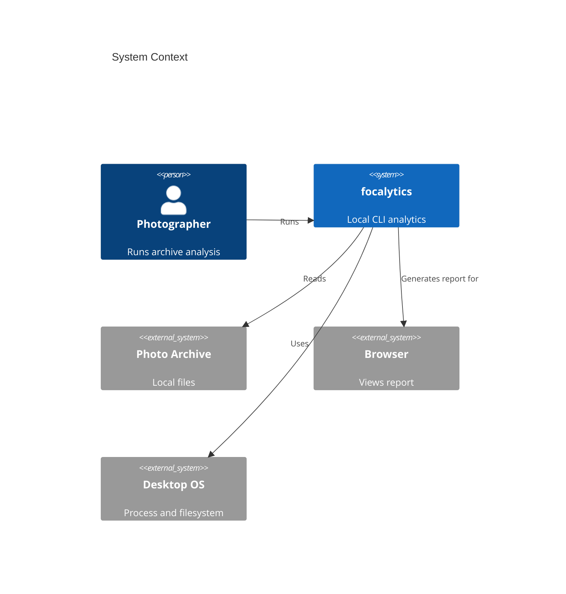
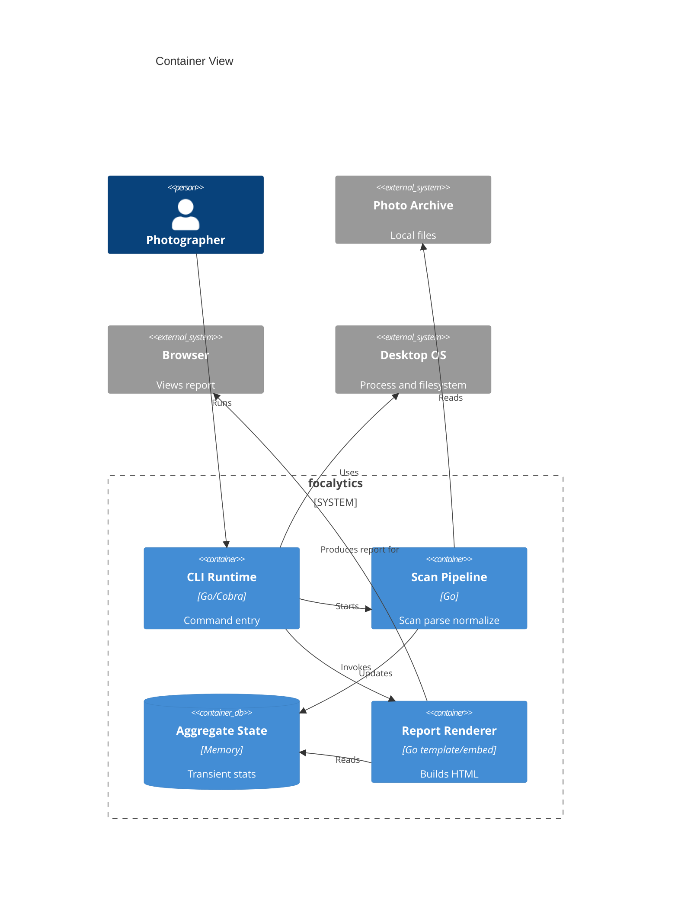
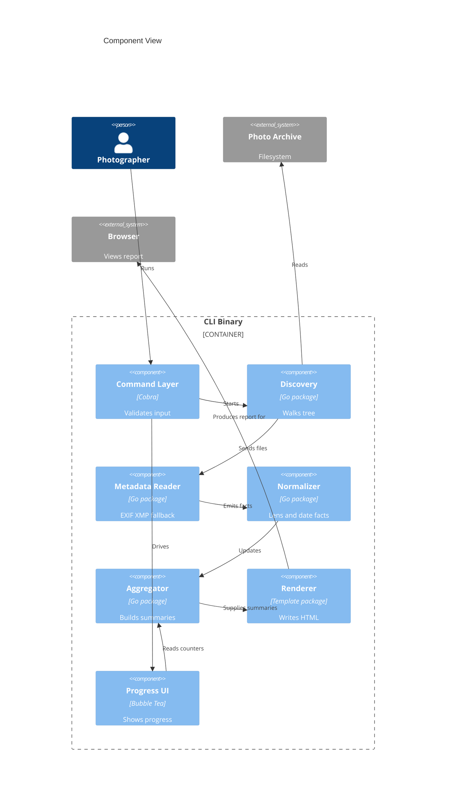
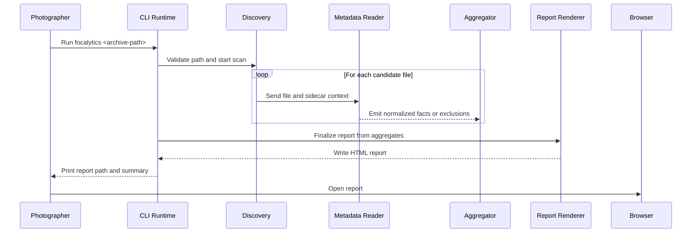
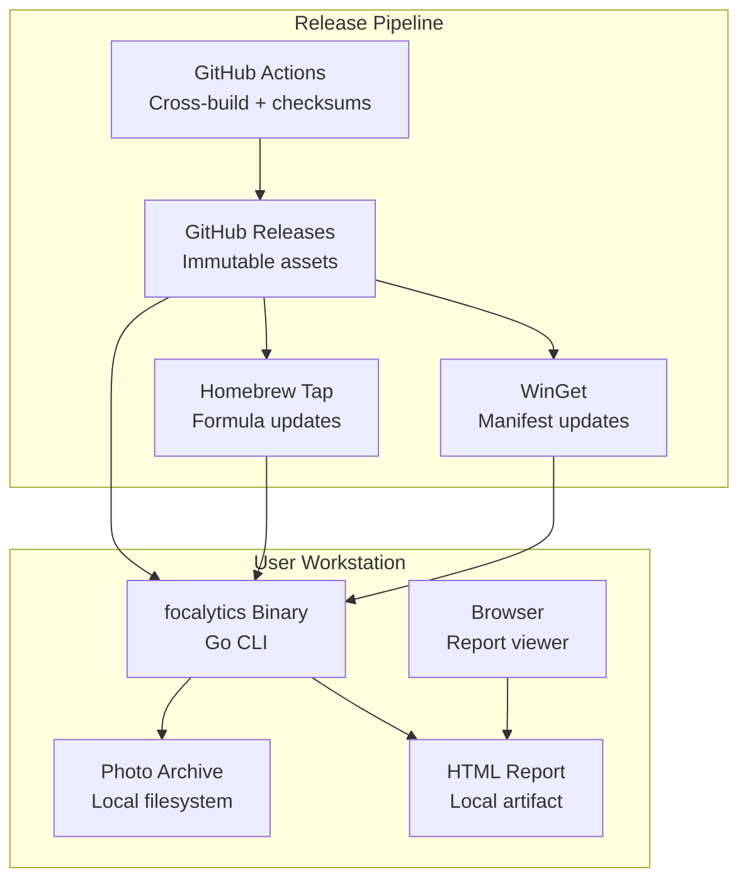

# Software Architecture Document: focalytics

> Date: 2026-04-05 | Status: Draft

## Purpose and Scope

focalytics is a local, privacy-first command-line system that scans large photo archives, extracts and reconciles image metadata, aggregates archive-level statistics in memory, and emits a self-contained HTML report. The architecture is intentionally narrow: one user, one local machine, one command invocation, no hosted backend, no persistent application database, and no dependency on network services at runtime.

The architecture must preserve three product-level properties from the canonical PRD: offline operation, zero-config first value, and trustworthy handling of incomplete or inconsistent metadata. The result should be a system that remains simple to install and reason about while still handling tens of thousands of files and years of archive history.

## Technical Context

**Language/Version**: Go 1.24 (project target for initial implementation)  
**Primary Dependencies**: Cobra, Bubble Tea, Bubbles, go-exif, Go `html/template`, Go `embed`, Go XML parsing 
**Storage**: Local filesystem inputs, transient in-memory aggregates, generated HTML file output; no persistent application database  
**Testing**: `go test`, table-driven unit tests, fixture-based integration tests, golden-file report tests, benchmark tests 
**Target Platform**: Desktop CLI on macOS, Windows, and Linux  
**Project Type**: Single application 
**Performance Goals**: Produce a first report within 15 minutes for representative validation archives; keep progress updates responsive during long scans; bound memory growth by aggregate cardinality rather than file count  
**Constraints**: Offline-only runtime, zero-config invocation, no source-file mutation, no network calls during scan or report use, self-contained report output, cross-platform release packaging  
**Scale/Scope**: Single-user runs against archives spanning decades and typically tens of thousands of photos per invocation

## System Scope and Context

focalytics lives entirely on the user's workstation. Its primary system boundary is the local executable and the runtime modules inside it. The system reads untrusted local files from user-selected directory trees, derives metadata facts from images and sidecars, transforms those facts into aggregated summaries, and writes a static report artifact for local viewing.

There are no runtime service dependencies. External interactions are limited to local filesystems, the desktop OS, a browser used to open the generated report, and distribution infrastructure used before runtime to install the binary.

### C4 System Context

### C4 Container View

### C4 Component View

## Solution Strategy and Architecture Style

- **Architecture Style**: Local modular monolith inside a single executable.
- **Source Code Location**: All project source code must reside in the `/src` directory.
- **Why this style fits**: The product has one dominant execution flow, no runtime service topology, and strong requirements around offline behavior, portability, and low operational overhead. A modular monolith keeps the binary easy to distribute while isolating concerns such as discovery, parsing, normalization, aggregation, rendering, and progress reporting.
- **Alternatives considered**: Hosted analysis service was rejected because it violates privacy-first and offline goals. A local persistent database/index was rejected for the first release because it adds setup, migration, and corruption risk before the product proves demand. A plugin-oriented pipeline was rejected because it would complicate the zero-config contract too early.

## Key Runtime Flows and Failure Paths

### Primary Flow

### Failure Paths

- Unreadable directory entry -> record warning, increment exclusion counters, continue scan unless the root path itself is invalid.
- Corrupted or unsupported metadata -> attempt lower-priority fallback sources, then exclude only the affected metric rather than the entire file.
- Missing normalization lookup data -> preserve available focal data, mark normalization gap, and exclude that dimension where needed.
- Output write failure -> stop finalization, return a non-zero exit code, and keep diagnostics explicit because no trustworthy report was produced.
- User cancellation or interrupt -> stop traversal cleanly, flush final diagnostics, and avoid writing a report that appears complete when it is not.

## Deployment and Infrastructure View

## Cross-Cutting Concerns

### Security

The runtime trust boundary is the local workstation. Photo files, sidecars, directory names, and metadata fields are all untrusted input and must be parsed defensively. The system must never modify source archives, execute embedded content, or rely on network access. Release assets should be checksum-published and distributed from immutable GitHub Release artifacts so package-manager channels point to the same binaries.

### Reliability

Reliability depends on graceful degradation rather than perfect metadata. The scan pipeline should continue past corrupt files, unsupported tags, and partial sidecar failures while preserving explicit counters and warnings. Traversal behavior should be deterministic, and concurrency must remain bounded so large scans do not become unstable or memory-explosive.

### Observability

Observability is local, not service-based. The CLI should emit concise progress updates during execution and actionable warnings to `stderr` for skipped files, parse failures, and report-generation failures. Diagnostic summaries should capture counts for files seen, files parsed, excluded metrics, fallbacks used, and elapsed time. Benchmarking and profiling for large archives should use Go's built-in testing and profiling tools before concurrency or memory optimizations are introduced.

### Data Management

The source archive remains the system of record. focalytics should treat raw metadata as transient processing input, retain only the aggregated statistics required to render the report during execution, and write the generated report as the only durable artifact by default. No persistent index, cache, or application database is required in the initial architecture.

### Integration Strategy

Runtime integrations are deliberately minimal: local filesystem access, sidecar correlation, browser rendering of static HTML, and OS process capabilities. Build-time integrations include GitHub Actions for release automation and package-manager update workflows for Homebrew and WinGet. The architecture should not assume any cloud API, hosted telemetry, or authentication provider.

### Operations

There is no hosted production environment and no support desk. Operational responsibility is limited to maintaining build pipelines, release artifacts, checksums, and installation channels. Runtime failures are user-local events surfaced through command output rather than incidents in a managed service.

## Quality Attributes

| Attribute | Target | Measurement | Notes |
|-----------|--------|-------------|-------|
| Performance | Generate a first report within 15 minutes for representative validation archives on consumer hardware | Fixture-archive integration runs and benchmark suites | Aligns with the product validation target for first insight |
| Reliability | Zero fatal crashes on corrupted-file fixture suites; continue scanning when individual files fail | Integration tests with malformed images, broken sidecars, and permission edge cases | Failure should degrade per file or metric, not per run |
| Security | Zero runtime network calls and zero source-file mutations during normal execution | CI checks, integration tests, and manual verification on representative runs | Local files remain untrusted input |
| Maintainability | Core pipeline responsibilities remain isolated into separate packages with stable interfaces | Package-level test coverage and architecture review during planning | Prevents a monolithic `main` from becoming the design center |
| Scalability | Support single-user runs against archives with tens of thousands of files without architectural redesign | Benchmark suites and representative archive validations | Scale is local dataset size, not multi-user traffic |

## Architecture Decisions

### ADR-001: Use a Local Modular Monolith

- **Status**: Accepted
- **Context**: focalytics has one user-driven execution path and strong privacy, portability, and offline requirements.
- **Decision**: Implement the product as a single local executable with internal module boundaries for command handling, discovery, metadata processing, aggregation, rendering, and progress UI.
- **Rationale**: This keeps installation and runtime behavior simple while still allowing the codebase to remain maintainable as functionality grows.
- **Alternatives Considered**: Hosted service, multi-process local architecture, plugin-driven execution model.
- **Tradeoffs**: Distribution and runtime are simpler, but internal package boundaries must be enforced deliberately because process boundaries do not exist.
- **Consequences**: The codebase must prevent feature accretion into a single orchestration package and keep internal APIs explicit.

### ADR-002: Keep Processing Stateless Per Run

- **Status**: Accepted
- **Context**: The product promise is zero-config first value, and the first release does not require historical indexing or interactive querying.
- **Decision**: Treat each invocation as a standalone scan that reads local files, aggregates in memory, writes one report, and exits without persistent application state.
- **Rationale**: Stateless runs remove migration, cache invalidation, and corruption-recovery complexity while keeping user expectations simple.
- **Alternatives Considered**: Persistent local index, embedded database, incremental cache.
- **Tradeoffs**: Repeated scans reprocess files, but architecture and failure modes remain simpler and more predictable.
- **Consequences**: Performance work should focus on traversal, parsing, and aggregation efficiency rather than cache coherence.

### ADR-003: Use Layered Metadata Recovery With Explicit Exclusions

- **Status**: Accepted
- **Context**: Real-world photo archives contain incomplete, conflicting, or corrupt metadata across embedded tags and sidecars.
- **Decision**: Recover metadata in layers: embedded metadata first, matching XMP sidecars second, then defined fallbacks such as file timestamps or directory-derived hints, while tracking exclusions per metric.
- **Rationale**: This maximizes useful output without implying that every field is equally trustworthy.
- **Alternatives Considered**: Embedded metadata only, sidecars only, fail-the-run on inconsistent metadata.
- **Tradeoffs**: Data provenance becomes more complex, but report trustworthiness improves because missing dimensions are explicit.
- **Consequences**: Aggregation and rendering must retain exclusion counts and provenance-aware rules for chart eligibility.

### ADR-004: Generate a Self-Contained Static Report

- **Status**: Accepted
- **Context**: The product must work fully offline and should not require a local web server or external charting libraries.
- **Decision**: Render a single HTML artifact with embedded styling and locally generated visual elements from aggregated data.
- **Rationale**: A self-contained report preserves portability, privacy, and easy revisiting while minimizing runtime dependencies.
- **Alternatives Considered**: Hosted dashboard, local web server, report assets spread across multiple files, CDN-backed charting.
- **Tradeoffs**: Interactivity remains intentionally limited, but distribution and archival of the output are straightforward.
- **Consequences**: The rendering layer must optimize output size and avoid passing per-photo records into the frontend.

### ADR-005: Use Immutable Release Artifacts as the Distribution Root

- **Status**: Accepted
- **Context**: Cross-platform distribution relies on GitHub Releases, Homebrew, and WinGet, and users must be able to trust what they install.
- **Decision**: Publish canonical versioned binaries and checksums to GitHub Releases, then drive package-manager updates from those same assets.
- **Rationale**: One canonical artifact set avoids drift between channels and makes installation auditable.
- **Alternatives Considered**: Channel-specific builds, mutable release assets, manual package-manager packaging detached from releases.
- **Tradeoffs**: Release automation becomes more important, but downstream install paths stay consistent.
- **Consequences**: CI must build once per target matrix, publish checksums, and keep package-manager metadata pinned to published release artifacts.

## Risks, Assumptions, Constraints, and Open Questions

### Risks

- Metadata parser limitations or malformed files may create edge cases that are hard to normalize consistently across camera vendors and archive histories.
- Long-running scans on spinning disks, network-mounted drives, or very deep trees may produce user-visible performance variance that challenges a simple zero-config model.
- The absence of persistent indexing means repeated runs can be expensive for users who want frequent re-analysis of unchanged archives.
- Cross-platform filesystem differences may affect traversal, timestamp fallback behavior, and output-path expectations if they are not normalized carefully.

### Assumptions

- Most target users will run focalytics on a local archive stored on a workstation or directly attached storage.
- Enough metadata exists in embedded tags or sidecars for aggregated insights to be valuable even when some charts exclude files.
- A browser is available locally to open the generated report.
- The first release can defer persistent indexing, plugins, and interactive exploration without undermining the core value proposition.

### Constraints

- The system must operate without network access during scanning and report use.
- The system must not mutate source archives or write back metadata.
- The user-facing invocation model must remain centered on a single obvious command against a target directory.
- The architecture must remain portable across macOS, Windows, and Linux with release automation as the primary delivery mechanism.

### Open Questions

- What exact archive size and hardware profile should define the benchmark fixture used for performance validation?
- Which file formats are in the initial support matrix, especially for RAW variants with inconsistent metadata quality?
- How should crop-factor reference data be maintained and versioned if embedded 35mm-equivalent values are missing?
- Should the system eventually emit an additional machine-readable summary artifact alongside the HTML report, or is the HTML file the only durable output?

## Project Context Baseline Updates

- focalytics is architected as a local modular monolith packaged as a single Go executable.
- The runtime system has no hosted backend, no persistent application database, and no network dependency during normal use.
- The core processing pipeline is discovery -> metadata recovery -> normalization -> aggregation -> report rendering, with explicit per-metric exclusions and graceful degradation.
- Distribution infrastructure centers on immutable GitHub Release artifacts and downstream package-manager metadata derived from those assets.
- Feature-level command wiring should use constructor-based Cobra commands backed by internal runtime packages rather than package-global registration side effects.
- Progress reporting should remain a UI-agnostic event stream with a no-op-capable sink so CLI runs stay valid in both TTY and non-interactive environments.
- CLI stdout should remain reserved for durable success outputs, while progress UX and warnings stay on stderr or the terminal UI channel.
- The baseline Go QC stack is `gofmt`, `golangci-lint`, `govulncheck`, and native `go test` coverage tooling with cross-package coverage measurement.